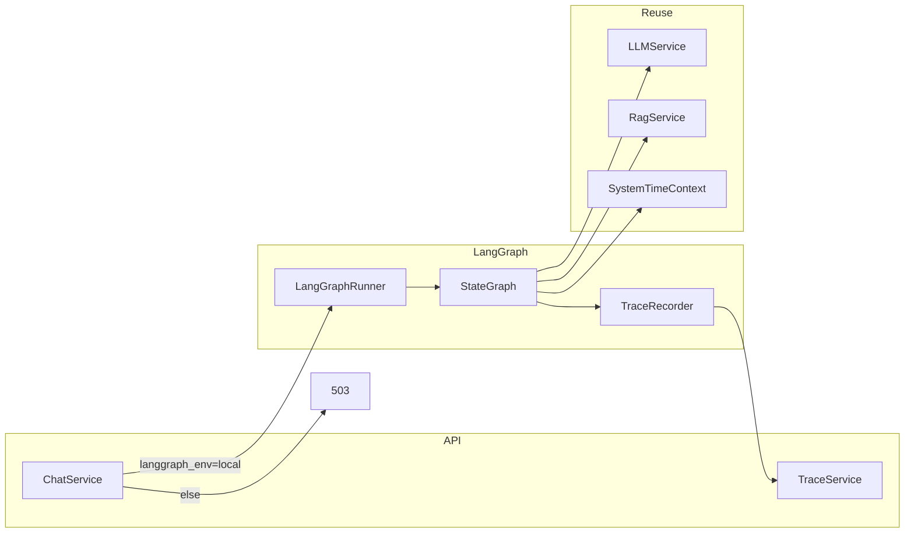

# T-012 LangGraph 真实编排 — 技术方案

> **任务 ID**：T-012  
> **依据文档**：`docs/agent/langgraph-flow.md`（去除测算版，节点 ID 不得修改）  
> **运行时**：项目根 `.venv/bin/python`；后端 `cd backend && PYTHONPATH=..`；端口 `8099`  
> **产出日期**：2026-06-12  
> **状态**：待 Developer 按 Phase 执行

---

## 1. 背景与目标

### 1.1 现状

| 项 | 现状 |
|----|------|
| 编排 | `chat_service._stream_assistant_reply` 线性：`intent → rag → stream answer → quality → create_llm_trace` |
| 目录 | 无 `backend/src/agents/`、`backend/src/integrations/langgraph/` |
| 依赖 | 根 `pyproject.toml` 无 `langgraph` |
| Trace 节点 | `preprocessing` / `llm_intent_recognition` / `router` 等，与 `langgraph-flow.md` 不一致 |
| 配置 | `LANGGRAPH_ENV` 字段存在（`settings.langgraph_env`）但未参与路由 |
| 前端 | TracePanel 按 `steps[].node` 通用渲染，不绑定具体 node ID |

### 1.2 目标

1. 实现与 `langgraph-flow.md` **节点 ID、分支条件一一对应** 的 LangGraph `StateGraph`。
2. `POST /api/chat/query` 在 `LANGGRAPH_ENV=local` 时**仅**走图编排；否则返回 **503**（禁止 fallback 线性链路为默认）。
3. Trace `steps[].node` 使用流转图英文 ID；管理端时间线可验收完整节点序列。
4. 去除独立测算 Agent：`calculator` 意图从 Prompt 移除；预测类问题走 `fallback_response`；可公式化计算仅经 `tool_call`。
5. `GET /api/config/status` 反映 LangGraph ready 状态。

### 1.3 非目标（T-012 不做）

- 真实金融数据 API 接入（继续用本地 Mock 数据工具）。
- 前端 TracePanel 组件重构（已通用渲染，仅需真实 node ID 数据）。
- LangGraph Cloud / 远程 checkpoint 持久化。
- 将线性链路保留为 silent fallback。

---

## 2. 架构总览



**分层原则**：

- `integrations/langgraph/`：图定义、状态类型、Runner、条件边、Trace 记录器（无业务 Prompt）。
- `agents/nodes/`：各节点纯函数，注入 `LLMService` / `RagService` / 工具。
- `integrations/llm/prompts/`：按节点拆分的 Prompt 模板（从 monolithic `prompts.py` 演进）。
- `services/chat_service.py`：会话持久化 + SSE 事件；**不**再内联意图/RAG/质检逻辑。
- `services/trace_service.py`：新增 `create_langgraph_trace()`，接收 Runner 产出的 steps。

---

## 3. 依赖与配置

### 3.1 新增依赖

在**项目根** `pyproject.toml` `[project.dependencies]` 追加：

```toml
"langgraph>=0.2.0",
"langchain-core>=0.3.0",   # LangGraph 运行时依赖，仅作类型/Runnable 支撑，不引入 LangChain Agent 框架
```

> 版本 pin 由 Developer 安装后锁定；mypy 对 `langgraph.*` 保持 `ignore_missing_imports`。

### 3.2 环境变量

| 变量 | 值 | 行为 |
|------|-----|------|
| `LANGGRAPH_ENV` | `local` | 启用 LangGraph Runner |
| `LANGGRAPH_ENV` | 空 / 其他 | `ChatService` 返回 503：`LangGraph 未就绪，请设置 LANGGRAPH_ENV=local` |

同步更新：`backend/.env.example`、`backend/config/app.toml`、`docs/startup.md`（Phase 4）。

### 3.3 config/status 扩展

**修改** `backend/src/models/config_status.py`：

```python
class OrchestrationStatusRead(BaseModel):
    name: Literal["langgraph"]
    env: str                    # 当前 LANGGRAPH_ENV 值（非密钥）
    status: Literal["ready", "blocked"]
    missing_requirements: list[str]  # 如 ["LANGGRAPH_ENV!=local", "LLM 未配置"]
```

**修改** `ConfigStatusRead`：新增字段 `orchestration: OrchestrationStatusRead`。

**修改** `ConfigStatusService.get_config_status()`：

```python
def _langgraph_status(self) -> OrchestrationStatusRead:
    missing: list[str] = []
    if self.settings.langgraph_env.strip() != "local":
        missing.append("LANGGRAPH_ENV 须为 local")
    if not LLMService(self.settings).is_configured():
        missing.append("LLM 主输出/意图识别未配置")
    # graph 编译检查可 lazy：首次 import build_graph 成功即视为 compiled
    return OrchestrationStatusRead(
        name="langgraph",
        env=self.settings.langgraph_env.strip(),
        status="ready" if not missing else "blocked",
        missing_requirements=missing,
    )
```

**验收**：`GET /api/config/status` → `data.orchestration.status === "ready"`（`LANGGRAPH_ENV=local` 且 LLM 已配）。

---

## 4. AgentState 设计

文件：`backend/src/integrations/langgraph/state.py`

使用 `typing.TypedDict, total=False` + `Annotated[list, operator.add]` 处理 `trace_steps` 累加（若采用 reducer）。

### 4.1 核心字段

```python
class AgentState(TypedDict, total=False):
    # --- 请求上下文（Runner 注入，图入口） ---
    session_id: str
    message_id: str
    trace_id: str
    user_query: str
    chat_history: list[dict[str, str]]      # [{role, content}]
    user_profile: dict[str, Any]
    request_meta: dict[str, Any]            # source: client|admin
    system_context: dict[str, str]          # SystemTimeContext.to_dict()

    # --- context_preprocess 输出 ---
    normalized_query: str
    context_pack: dict[str, Any]
    history_summary: str
    risk_hint: str

    # --- intent_recognition 输出 ---
    intent_id: str          # data_query | hotspot_analysis | stock_analysis | document_qa | chit_chat | unknown
    intent_name: str
    intent_confidence: float
    candidate_intents: list[dict[str, Any]]
    missing_slots: list[str]

    # --- slot_extraction 输出（可合并/覆盖 missing_slots） ---
    slots: dict[str, Any]
    slot_confidence: dict[str, float]
    ambiguous_slots: list[str]

    # --- clarification_check 输出 ---
    need_clarification: bool
    clarification_reason: str
    clarification_questions: list[str]

    # --- clarification_response 输出 ---
    next_expected_slots: list[str]

    # --- routing_decision 输出 ---
    route_target: str       # hotspot_agent | data_query_agent | stock_analysis_agent | document_qa_agent | fallback_response
    route_reason: str
    execution_plan: dict[str, Any]  # needs_rag, needs_tool, tool_names[], retrieval_config

    # --- 子 Agent 输出 ---
    agent_result: str
    evidence_list: list[dict[str, Any]]
    followup_need: bool
    data_table: list[dict[str, Any]]
    data_source: str
    analysis_dimensions: list[str]
    quoted_chunks: list[dict[str, Any]]
    doc_citations: list[dict[str, Any]]
    document_id: str

    # --- tool_call 输出 ---
    tool_params: dict[str, Any]
    tool_result: dict[str, Any]
    tool_status: Literal["success", "failed", "skipped"]
    tool_latency: int
    tool_error: str | None

    # --- rag_retrieval 输出 ---
    retrieval_config: dict[str, Any]
    retrieved_chunks: list[dict[str, Any]]
    retrieval_score: float
    citations: list[dict[str, Any]]
    low_confidence_flag: bool
    rag_hits: list[dict[str, Any]]          # 兼容现有 Trace rag_hits 字段

    # --- evidence_merge 输出 ---
    evidence_pack: dict[str, Any]
    citation_map: dict[str, Any]
    conflict_points: list[str]

    # --- quality_check 输出 ---
    quality_status: Literal["pass", "revise", "reject"]
    quality_score: float
    risk_level: str
    revision_suggestions: list[str]
    quality_check_payload: dict[str, Any]   # 完整质检 JSON

    # --- 最终输出 ---
    final_response: str
    response_meta: dict[str, Any]
    fallback_reason: str
    rich_blocks: list[dict[str, Any]]
    response_kind: str                      # stock | data | hotspot（去除 calculator）

    # --- Trace 与运行时 ---
    trace_steps: list[dict[str, Any]]       # 逐步 append 的 TraceStep 字典
    current_node: str
    error: str | None
    stream_callback: Any                    # 不序列化；Runner 注入，供 response_assembly 推 SSE
```

### 4.2 字段约定

- 节点函数**只写本节点负责的输出键**，不覆盖无关字段。
- `intent_id` 与 `route_target` 解耦：意图识别输出 `intent_id`，`routing_decision` 映射到 `route_target`（Agent 节点 ID）。
- `response_kind` 仅用于富响应/UI，取值 `stock | data | hotspot`，**不含** `calculator`。
- `trace_steps` 在图执行期间内存累积，**END** 前一次性落库。

---

## 5. 节点函数签名与实现要点

统一签名（所有节点）：

```python
async def node_xxx(state: AgentState, *, llm: LLMService, rag: RagService, settings: AppSettings) -> dict[str, Any]:
    """返回 state 局部更新（partial update）。"""
```

Runner 通过 `functools.partial` 或闭包注入依赖；**不**使用 LangChain Tool 抽象包裹现有 Service。

### 5.1 节点清单

| 节点 ID | 文件 | 核心逻辑 | 复用 |
|---------|------|----------|------|
| `context_preprocess` | `agents/nodes/context_preprocess.py` | 清洗 query、截断 history、`resolve_system_time()` → `system_context` | `SystemTimeContext` |
| `intent_recognition` | `agents/nodes/intent_recognition.py` | LLM JSON 意图 + 置信度 | `LLMService._intent_client()` + `prompts/intent.py` |
| `slot_extraction` | `agents/nodes/slot_extraction.py` | LLM 槽位 JSON | `prompts/slots.py` |
| `clarification_check` | `agents/nodes/clarification_check.py` | **纯规则**，无 LLM | 阈值见 §6.1 |
| `clarification_response` | `agents/nodes/clarification_response.py` | LLM 生成追问 | `prompts/clarification.py` |
| `routing_decision` | `agents/nodes/routing_decision.py` | 规则映射 `intent_id+slots` → `route_target` + `execution_plan` | 无 LLM |
| `hotspot_agent` | `agents/nodes/hotspot_agent.py` | LLM 子任务规划/要点提取 | `prompts/agents/hotspot.py` |
| `data_query_agent` | `agents/nodes/data_query_agent.py` | LLM + 准备 tool 参数 | `prompts/agents/data_query.py` |
| `stock_analysis_agent` | `agents/nodes/stock_analysis_agent.py` | LLM 分析维度规划 | `prompts/agents/stock_analysis.py` |
| `document_qa_agent` | `agents/nodes/document_qa_agent.py` | LLM 文档问答规划 | `prompts/agents/document_qa.py` |
| `tool_call` | `agents/nodes/tool_call.py` | 调用 `agents/tools/*` | Mock 数据读取 |
| `rag_retrieval` | `agents/nodes/rag_retrieval.py` | `RagService.retrieve()` | 现有 RAG 全链路 |
| `evidence_merge` | `agents/nodes/evidence_merge.py` | 合并 tool + rag + agent_result | 纯 Python |
| `quality_check` | `agents/nodes/quality_check.py` | `LLMService.quality_check()` 适配 | 现有质检 Prompt |
| `response_assembly` | `agents/nodes/response_assembly.py` | 流式生成 + `enrich_rich_blocks` | `generate_answer_stream` + `prompts/assembly.py` |
| `fallback_response` | `agents/nodes/fallback_response.py` | 安全兜底文案 | `prompts/fallback.py` |

每个节点末尾调用 `TraceRecorder.record(state, node_id, input_summary, output_summary, latency_ms)`。

### 5.2 `routing_decision` 映射表

| intent_id | 条件 | route_target |
|-----------|------|--------------|
| `hotspot_analysis` | — | `hotspot_agent` |
| `data_query` | — | `data_query_agent` |
| `stock_analysis` | — | `stock_analysis_agent` |
| `document_qa` | — | `document_qa_agent` |
| `prediction_request` | 收益/目标价/涨跌预测 | `fallback_response` |
| `chit_chat` / `unknown` | — | `fallback_response` |

`execution_plan` 示例：

```json
{
  "needs_rag": true,
  "needs_tool": true,
  "tool_names": ["mock_market_ranking_lookup"],
  "retrieval_config": {"top_k": 8, "filters": {}}
}
```

---

## 6. 条件边逻辑

文件：`backend/src/integrations/langgraph/routing.py`

### 6.1 `clarification_check` 之后

```python
def route_after_clarification(state: AgentState) -> Literal["clarification_response", "routing_decision"]:
    if state.get("need_clarification"):
        return "clarification_response"
    return "routing_decision"
```

**`need_clarification` 判定规则**（`clarification_check` 节点内）：

| 条件 | 结果 |
|------|------|
| `intent_confidence < 0.70` | `need_clarification=True` |
| 核心槽位缺失（问股无 `stock_name`/`stock_code`；问数无 `metric`；文档无 `document_id` 且无上下文文档） | True |
| `ambiguous_slots` 非空 | True |
| 时间范围缺失但可用默认值（如「近一交易日」） | **不**澄清，写入 `clarification_reason` 说明默认 |

`clarification_response` → `END`（直接返回追问，不经质检/组装）。

### 6.2 `routing_decision` 之后

```python
def route_after_routing(state: AgentState) -> str:
    return state["route_target"]  # 直接返回 Agent 节点名或 fallback_response
```

### 6.3 子 Agent 之后（并行 RAG / Tool）

使用 LangGraph `Send` API（`langgraph.types.Send`）：

```python
def fanout_after_agent(state: AgentState) -> list[Send]:
    plan = state.get("execution_plan") or {}
    sends: list[Send] = []
    if plan.get("needs_rag"):
        sends.append(Send("rag_retrieval", state))
    if plan.get("needs_tool"):
        sends.append(Send("tool_call", state))
    if not sends:
        sends.append(Send("evidence_merge", state))  # 两者都不需要时直连汇聚
    return sends
```

`rag_retrieval` 与 `tool_call` 均 `→ evidence_merge`（LangGraph 自动等待并行分支完成）。

**各 Agent 默认 execution_plan**：

| Agent | needs_rag | needs_tool | tool_names |
|-------|-----------|------------|------------|
| `hotspot_agent` | true | true（可选） | `mock_hotspot_material_lookup` |
| `data_query_agent` | false | true | `mock_market_ranking_lookup` |
| `stock_analysis_agent` | true | true | `mock_financial_profile_lookup` |
| `document_qa_agent` | true | false | — |

### 6.4 `quality_check` 之后

```python
def route_after_quality(state: AgentState) -> Literal["response_assembly", "fallback_response"]:
    if state.get("quality_status") == "reject":
        return "fallback_response"
    return "response_assembly"  # pass 与 revise 均组装，revise 带 revision_suggestions
```

**reject 触发**：`risk_level == "high"`、工具失败且 `low_confidence_flag`、黑名单命中、证据严重不足。

### 6.5 终止边

- `clarification_response` → `END`
- `response_assembly` → `END`
- `fallback_response` → `END`

---

## 7. 去除测算版：calculator 意图处理

### 7.1 Prompt 层（Phase 1 即改）

**修改** `integrations/llm/prompts/intent.py`（自 `prompts.py` 拆出）：

- 删除 `response_kind: calculator` 及「回报/收益/测算 → calculator」规则。
- 新增 `intent_id: prediction_request`：命中「预测明天涨跌」「给目标价」「一定涨」等。
- `prediction_request` 在 `routing_decision` **直接** `route_target=fallback_response`。

### 7.2 可公式化计算（唯一合法计算路径）

当用户给出**完整可计算参数**（买入价、份额、费率等）且意图为「收益率/盈亏计算」：

1. `intent_recognition` → `intent_id=data_query`（非 prediction）。
2. `routing_decision` → `data_query_agent`，`execution_plan.needs_tool=true`，`tool_names=["local_return_calculator"]`。
3. `tool_call` 节点调用 `agents/tools/return_calculator.py`：

```python
def compute_return(*, buy_price: float, sell_price: float, share_count: int, fee_rate: float) -> dict:
    """固定公式，禁止 LLM 参与数值计算。"""
    gross = (sell_price - buy_price) * share_count
    fee = (buy_price + sell_price) * share_count * fee_rate
    return {"net_profit": gross - fee, "return_pct": (sell_price / buy_price - 1) * 100, ...}
```

4. `response_assembly` 只**引用** `tool_result` 数字，LLM 负责解释与风险提示。

### 7.3 禁止行为

- 不得由 LLM 自由生成目标价、未来涨跌、估值测算。
- 不得保留 `rich_blocks.type=calculator` 由模型填 payload 数字（可保留展示块，但数字必须来自 `tool_result`）。
- 不得恢复 T-007 `create_fallback_trace` / 线性 `_stream_assistant_reply` 为默认路径。

---

## 8. Sub-agent Prompt 拆分

| Prompt 模块 | 路径 | 注入节点 | 说明 |
|-------------|------|----------|------|
| 系统时间块 | `system_time.prompt_block()` | `context_preprocess` 写入 state；各 LLM 节点 system 前置 | 复用 T-011a |
| 意图识别 | `prompts/intent.py` | `intent_recognition` | 输出 `intent_id` + confidence |
| 槽位抽取 | `prompts/slots.py` | `slot_extraction` | 标的/行业/时间/指标 |
| 澄清追问 | `prompts/clarification.py` | `clarification_response` | 结构化追问 |
| 热点 Agent | `prompts/agents/hotspot.py` | `hotspot_agent` | 催化/政策/产业链 |
| 问数 Agent | `prompts/agents/data_query.py` | `data_query_agent` | 排行/指标查询 |
| 问股 Agent | `prompts/agents/stock_analysis.py` | `stock_analysis_agent` | 基本面/技术面 |
| 文档 Agent | `prompts/agents/document_qa.py` | `document_qa_agent` | 研报/年报问答 |
| 回答组装 | `prompts/assembly.py` | `response_assembly` | 基于 `evidence_pack` 流式 Markdown |
| 质检 | `prompts/quality.py` | `quality_check` | 自现有 `QUALITY_SYSTEM_PROMPT` 迁移 |
| 兜底 | `prompts/fallback.py` | `fallback_response` | 证据不足/合规兜底 |

`prompts/__init__.py` 导出工厂函数 `xxx_prompt(ctx: SystemTimeContext) -> str`，保持与 T-011a `with_system_time` 模式一致。

原 `prompts.py` 保留 re-export 别名，避免一次性破坏所有 import（Phase 4 清理）。

---

## 9. Trace 写入策略

### 9.1 选定方案：**逐步执行写 step（推荐）**

每个节点完成时：

1. `TraceRecorder.record()` 构造符合 `TraceStepRead` 契约的 step dict（`node` = 流转图 ID）。
2. `append` 到 `state["trace_steps"]`。
3. 可选：经 `stream_callback` 推送 SSE `{"event":"trace_step","data":{...}}`（Phase 4，非必须）。

图执行结束后（`END` 或 Runner `finally`）：

4. `TraceService.create_langgraph_trace(trace_id, session_id, message_id, user_query, steps, metadata)` **一次性** `repo.create_trace()`。

### 9.2 不采用「事后拼装」的原因

- 线性 `create_llm_trace` 事后拼装导致 node ID 漂移、并行分支（rag+tool）顺序不稳定。
- 逐步写入可保留真实耗时、失败节点 `status=failed`、与 SSE `status` 相位对齐。

### 9.3 TraceRecorder 接口

文件：`backend/src/integrations/langgraph/trace_recorder.py`

```python
NODE_DISPLAY_NAMES: dict[str, str] = {
    "context_preprocess": "上下文预处理",
    "intent_recognition": "意图识别",
    # ... 与 langgraph-flow.md 一致
}

class TraceRecorder:
    @staticmethod
    def record(
        *,
        node: str,
        step_index: int,
        status: Literal["success", "failed"],
        latency_ms: int,
        input_data: dict,
        output_data: dict,
        summary: str,
        error: str | None = None,
    ) -> dict[str, Any]:
        """返回完整 step dict，含 step_id、detail_sections、raw_json。"""
```

### 9.4 `create_langgraph_trace` vs `create_llm_trace`

- **新增** `TraceService.create_langgraph_trace()`：直接接受 `steps: list[dict]`，metadata 从 steps 聚合 `total_latency_ms`、`tool_calls_count`、`model_versions`。
- **保留但弃用默认路径** `create_llm_trace()`：仅单元测试或显式 legacy 调用；`chat_service` 不再调用。
- `trace_service._rag_step()` 逻辑迁入 `rag_retrieval` 节点 + `TraceRecorder`，保留 `rerank_before/after` 字段（T-011 经验）。

### 9.5 END 节点

流转图定义 `END` 节点 Trace：Runner 在落库前 append 一步：

```json
{"node": "END", "output": {"response": "...", "trace_id": "..."}}
```

---

## 10. chat_service 切换方案

### 10.1 门禁函数

```python
# backend/src/integrations/langgraph/runner.py
def is_langgraph_enabled(settings: AppSettings | None = None) -> bool:
    return (settings or get_settings()).langgraph_env.strip() == "local"
```

### 10.2 `_stream_assistant_reply` 改造

```python
async def _stream_assistant_reply(...):
    if not is_langgraph_enabled():
        yield {"event": "error", "data": {"message": "LangGraph 未就绪，请设置 LANGGRAPH_ENV=local", "code": 503}}
        return
    if not self.llm.is_configured():
        yield {"event": "error", "data": {"message": "LLM 配置不完整", "code": 503}}
        return

    runner = LangGraphRunner(self.llm, self.rag, self.db)
    async for event in runner.run_stream(session, user_message, normalized_query, source):
        yield event
```

**删除**原线性：`recognize_intent` → `rag.retrieve` → `generate_answer_stream` → `quality_check` → `create_llm_trace`。

### 10.3 LangGraphRunner SSE 事件映射

| 图内相位 | SSE event |
|----------|-----------|
| `intent_recognition` | `status: {phase: "thinking", label: "正在识别意图…"}` |
| `rag_retrieval`（索引构建） | `status: {phase: "indexing", ...}` / `retrieving` |
| `response_assembly` 流式 | `content_delta` / `content_done` / `rich_blocks` |
| `quality_check` | `status: {phase: "quality_check", ...}` |
| 完成 | `done`（含 `ChatQueryResponse`） |

### 10.4 消息持久化

Runner 在 `END` 后：

1. 创建 `assistant_message`（content = `final_response`，rich_blocks 来自 `response_assembly`）。
2. 调用 `create_langgraph_trace`。
3. 更新 session `last_trace_id`。

---

## 11. 图构建与 Runner

### 11.1 `build_graph()`

文件：`backend/src/integrations/langgraph/graph.py`

```python
from langgraph.graph import StateGraph, END

def build_graph(deps: GraphDeps) -> CompiledGraph:
    g = StateGraph(AgentState)
    for name, fn in ALL_NODES.items():
        g.add_node(name, partial(fn, **deps))
    g.set_entry_point("context_preprocess")
    g.add_edge("context_preprocess", "intent_recognition")
    g.add_edge("intent_recognition", "slot_extraction")
    g.add_edge("slot_extraction", "clarification_check")
    g.add_conditional_edges("clarification_check", route_after_clarification, {...})
    g.add_edge("clarification_response", END)
    g.add_conditional_edges("routing_decision", route_after_routing, {...})
    for agent in AGENT_NODES:
        g.add_conditional_edges(agent, fanout_after_agent, ["rag_retrieval", "tool_call", "evidence_merge"])
    g.add_edge("rag_retrieval", "evidence_merge")
    g.add_edge("tool_call", "evidence_merge")
    g.add_conditional_edges("quality_check", route_after_quality, {...})
    g.add_edge("response_assembly", END)
    g.add_edge("fallback_response", END)
    return g.compile()
```

模块级单例：`@lru_cache def get_compiled_graph(): ...` 避免每次请求编译。

### 11.2 Runner

文件：`backend/src/integrations/langgraph/runner.py`

- `run_stream()`：`astream` 或 `ainvoke` + 中间回调。
- 注入 `chat_history`：从 `SessionRepository` 读取最近 N 条消息。
- 异常：节点内捕获 → `state.error` + step `status=failed` → 图路由 `fallback_response` 或向上抛出 `LLMClientError`。

---

## 12. 工具层（tool_call）

目录：`backend/src/agents/tools/`

| 工具名 | 文件 | 数据源 |
|--------|------|--------|
| `mock_market_ranking_lookup` | `mock_market.py` | `data/mock/market/` |
| `mock_financial_profile_lookup` | `mock_financial.py` | `data/mock/financial/` |
| `mock_hotspot_material_lookup` | `mock_hotspot.py` | `data/mock/` + KB |
| `local_return_calculator` | `return_calculator.py` | 固定公式 |

从 `trace_service._tool_call()` 迁移真实请求/响应结构，但 node ID 统一为 `tool_call`（非 `fallback_tool_call`）。

---

## 13. 文件清单

### 13.1 新增

```
backend/src/integrations/langgraph/
  __init__.py
  state.py
  graph.py
  routing.py
  runner.py
  trace_recorder.py

backend/src/agents/
  __init__.py
  nodes/
    __init__.py
    context_preprocess.py
    intent_recognition.py
    slot_extraction.py
    clarification_check.py
    clarification_response.py
    routing_decision.py
    hotspot_agent.py
    data_query_agent.py
    stock_analysis_agent.py
    document_qa_agent.py
    tool_call.py
    rag_retrieval.py
    evidence_merge.py
    quality_check.py
    response_assembly.py
    fallback_response.py
  tools/
    __init__.py
    mock_market.py
    mock_financial.py
    mock_hotspot.py
    return_calculator.py

backend/src/integrations/llm/prompts/
  __init__.py
  intent.py
  slots.py
  clarification.py
  assembly.py
  fallback.py
  quality.py
  agents/
    hotspot.py
    data_query.py
    stock_analysis.py
    document_qa.py

backend/tests/
  test_langgraph_routing.py      # 条件边单测
  test_langgraph_nodes.py        # 各节点 mock LLM 单测
  test_langgraph_trace.py        # 集成：node ID 序列
  test_langgraph_chat.py         # Chat API + LANGGRAPH_ENV 门禁
```

### 13.2 修改

```
pyproject.toml                          # +langgraph, langchain-core
backend/.env.example                    # LANGGRAPH_ENV=local 说明
backend/config/app.toml                 # langgraph_env 注释
backend/src/services/chat_service.py    # 仅 LangGraph 路径
backend/src/services/trace_service.py   # +create_langgraph_trace
backend/src/services/config_status_service.py
backend/src/models/config_status.py
backend/src/integrations/llm/prompts.py # re-export + 去除 calculator
backend/tests/test_health.py            # orchestration 字段断言
backend/tests/test_api_regression.py    # autouse mock 或 LANGGRAPH_ENV fixture
docs/startup.md                         # LangGraph 启动说明
```

### 13.3 不修改（除非契约测试失败）

```
frontend/src/**                         # TracePanel 已通用渲染
docs/agent/langgraph-flow.md            # 节点 ID 权威来源，禁止改
```

---

## 14. 测试策略

### 14.1 单元测试 — 条件边（`test_langgraph_routing.py`）

- `intent_confidence=0.65` → `clarification_response`。
- 问股缺 `stock_name` → 澄清。
- `quality_status=reject` → `fallback_response`。
- `fanout_after_agent`：`needs_rag+needs_tool` → 2 个 `Send`。

### 14.2 单元测试 — 节点 mock（`test_langgraph_nodes.py`）

- 每个节点：mock `LLMService.chat_completion` 返回固定 JSON，断言输出 state 键。
- `tool_call`：mock 工具，断言 `tool_status`。
- `rag_retrieval`：mock `RagService.retrieve`，断言 `rag_hits` 结构含 `rerank_before`。
- `return_calculator`：固定输入输出快照。

### 14.3 集成测试 — Trace node ID（`test_langgraph_trace.py`）

- `LANGGRAPH_ENV=local` + mock 全部 LLM 响应。
- 执行 `build_graph().ainvoke(initial_state)`。
- 断言 `steps[].node` 序列包含：
  - 问数路径：`context_preprocess` → … → `data_query_agent` → `tool_call` → `evidence_merge` → `quality_check` → `response_assembly`。
  - 澄清路径：含 `clarification_check` → `clarification_response` → `END`。
  - 预测问题：`fallback_response`，**无** `tool_call` 计算数字。

### 14.4 Chat API 测试（`test_langgraph_chat.py`）

- `LANGGRAPH_ENV=""` → `POST /api/chat/query` 返回 503。
- `LANGGRAPH_ENV=local` + LLM mock → 200 + `trace.steps[0].node == "context_preprocess"`。
- 现有 `test_llm_integration.py` / `test_sessions_layout.py` chat 测试：增加 `autouse` fixture 设置 `LANGGRAPH_ENV=local` 并 mock Runner 或 LLM。

### 14.5 真实联调（Tester / `REAL_API_TEST=1`）

- 热点 / 问数 / 问股 / 文档各 1 条；管理端 Trace 展开核对 node ID。
- `GET /api/config/status` → `orchestration.status=ready`。
- **不得**用 `create_fallback_trace` 或旧 node ID 判 PASS。

---

## 15. 开发 Phase 拆分（4 Phase，可独立验收）

### Phase 1 — 基础设施与状态机骨架

**目标**：依赖就绪、AgentState、空图可编译、config/status、Trace 写入骨架、去除 calculator Prompt。

| 交付物 | 验收 |
|--------|------|
| `pyproject.toml` 安装 langgraph | `import langgraph` 成功 |
| `state.py` + `graph.py` 骨架（节点 stub 返回空 dict） | `build_graph().compile()` 无异常 |
| `trace_recorder.py` + `create_langgraph_trace()` | 单测写入 1 个 `context_preprocess` step |
| `config/status` orchestration 字段 | `test_health` 通过 |
| `prompts/intent.py` 去除 calculator，加 `prediction_request` | 意图 Prompt 快照测试 |
| `is_langgraph_enabled()` | `LANGGRAPH_ENV!=local` 时函数返回 False |

**Phase 1 完成标志**：`ruff` / `mypy` / `pytest` 通过；`orchestration` 字段可见；图可编译但尚未接入 Chat。

---

### Phase 2 — 前置链路（预处理 → 澄清 / 路由）

**目标**：实现 `context_preprocess` ～ `routing_decision` + `clarification_response` 分支。

| 交付物 | 验收 |
|--------|------|
| 6 个前置节点真实逻辑 + Prompt | 节点单测通过 |
| 条件边 `clarification_check` | routing 单测覆盖 4 种分支 |
| 每节点写 Trace step | 集成测试：模糊问题 → steps 含 `clarification_response` |
| `routing_decision` 输出 `route_target` | 4 类意图映射单测 |

**Phase 2 完成标志**：对应用例 invoke 图可终止于 `clarification_response` 或进入 `route_target` stub；Trace node ID 与文档一致（前置段）。

---

### Phase 3 — 执行链路（子 Agent → RAG/Tool → 质检 → 组装）

**目标**：子 Agent、并行 RAG+Tool、evidence_merge、quality、response_assembly、fallback。

| 交付物 | 验收 |
|--------|------|
| 4 个子 Agent + `tool_call` + `rag_retrieval` | mock 集成测试 |
| `agents/tools/*` | tool_call 单测 |
| `Send` 并行 + `evidence_merge` | 问股路径同时含 `rag_retrieval` 与 `tool_call` |
| `quality_check` 复用 `LLMService.quality_check` | reject → `fallback_response` |
| `response_assembly` 流式 + rich_blocks | 流式单测 |
| `prediction_request` → `fallback_response` | 无 LLM 测算数字 |

**Phase 3 完成标志**：`build_graph().ainvoke` 在 mock LLM 下可走通问数/问股/热点/兜底全路径；Trace steps 节点 ID 完整。

---

### Phase 4 — Chat 接入、门禁、回归与文档

**目标**：替换 `chat_service` 线性链路；503 门禁；前端真实联调；全量测试。

| 交付物 | 验收 |
|--------|------|
| `LangGraphRunner` + `chat_service` 改造 | `LANGGRAPH_ENV=local` Chat 200 |
| 非 local 返回 503 | 单测断言 |
| SSE 事件与现前端兼容 | 客户端收流式回答 |
| `test_langgraph_chat.py` + 修复既有测试 | 全量 pytest 通过 |
| `docs/startup.md` | LangGraph 配置说明 |
| 前端 `VITE_USE_MOCK=false` 联调 | Trace 时间线 node ID 与流转图一致 |

**Phase 4 完成标志**：满足 `tasks.json` T-012 全部 `acceptanceCriteria` 与 `technicalChecks`；用户门禁可验收。

---

## 16. 风险与缓解

| 风险 | 缓解 |
|------|------|
| LangGraph 并行 `Send` API 版本差异 | Phase 3 首日锁定版本并写最小并行样例测试 |
| 全图真实 LLM 调用延迟高 | 节点级超时日志；status SSE 保持用户感知 |
| 既有 pytest 未设 `LANGGRAPH_ENV` 全挂 | Phase 4 统一 `conftest.py` autouse fixture |
| 流式仅在 `response_assembly` | 前置节点通过 `status` 事件反馈，不流式 LLM |
| RAG 首次建索引耗时 | 复用 T-010 `rag_retrieval` 内 `ensure_index` + indexing status |

---

## 17. 经验约束（必须遵守）

来自 `.sdd/experience.md` / 系统经验：

1. **T-011a**：所有 LLM 节点 System Prompt 前置 `SystemTimeContext`；`context_preprocess` 写入 `system_context` 供 Trace 展示。
2. **T-011**：`rag_retrieval` Trace 保留 `rerank_before/after`。
3. **T-009**：httpx 继续 `trust_env=False`。
4. **T-007**：UI 不展示「LangGraph 未接入」；503 仅 API 错误，工程状态走 config/status。
5. **Harness**：`LANGGRAPH_ENV!=local` 时不得 silent fallback 线性链路。

---

## 18. Developer 执行顺序摘要

```
Phase 1 → Phase 2 → Phase 3 → Phase 4
每 Phase 结束：ruff + mypy + pytest → 简短 developer-report 片段 → 再进下一 Phase
```

**Phase 列表**：

| Phase | 名称 | 独立验收要点 |
|-------|------|--------------|
| **P1** | 基础设施与状态机骨架 | langgraph 依赖、AgentState、图编译、config/status orchestration、TraceRecorder |
| **P2** | 前置链路 | context_preprocess → clarification / routing_decision + Trace 前置节点 |
| **P3** | 执行链路 | 子 Agent、RAG+Tool 并行、质检、组装/兜底、去除测算 |
| **P4** | Chat 接入与回归 | chat_service 仅 LangGraph、503 门禁、SSE、全量测试、前端联调 |

---

*本方案仅描述设计与任务拆分，不包含实现代码。Developer 开工前请再读 `docs/agent/langgraph-flow.md` 与 `tasks.json` T-012 `acceptanceCriteria`。*
