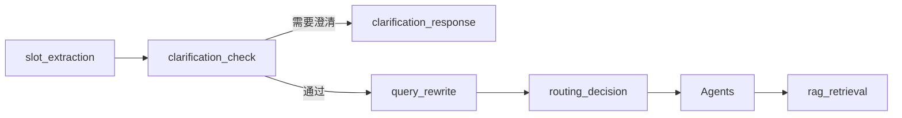

# T-014 Query 改写节点（F18）— 技术方案

> **任务 ID**：T-014  
> **依据文档**：`docs/agent/langgraph-flow.md` §7.1、`docs/Plan.md` F18、`.sdd/tasks.json`  
> **前置**：T-015 ✅、T-016 ✅、T-017（技术验收 PASS）  
> **产出日期**：2026-06-19  
> **状态**：待 Developer 执行

---

## 1. 背景与目标

### 1.1 现状

- `rag_retrieval` 主路径检索 Query = `normalized_query`（如「一季报呢」「它一季报怎么样」）
- `slots.stock_name` 已参与 `entity_name` 过滤（T-017），但 **BM25/向量仍用短句**，召回率不足
- `langgraph-flow.md` 规划了 `query_rewrite` 节点与 `retrieval_query` 字段，**未实现**

### 1.2 目标（T-014 = Phase ① 规则 + 槽位拼接）

1. 新增 LangGraph 节点 **`query_rewrite`**（无 LLM，纯规则）
2. 产出 **`retrieval_query`** 写入 state；`rag_retrieval` **优先使用** `retrieval_query`，缺省回退 `normalized_query`
3. Trace 可见 **改写前后对比**（`normalized_query` / `retrieval_query` / `rewrite_method`）
4. **Embedding 不可用**时不阻断：改写仅为字符串构建，RAG 仍走既有 BM25-only 降级

### 1.3 非目标（本任务不做）

- Phase ② LLM 改写节点
- Phase ③ 多 Query 扩展 / HyDE（`retrieval_queries[]` 可预留字段，不实现）
- `gap_planner` supplement 查询改写（仍用 planner 产出 queries）
- 前端改造

---

## 2. 图结构变更



**边调整**（`graph.py`）：

```python
# route_after_clarification: 无澄清 → "query_rewrite"（原 "routing_decision"）
graph.add_edge("query_rewrite", "routing_decision")
```

澄清链路 **不经过** `query_rewrite`（无完整槽位时不改写）。

---

## 3. 新建 `backend/src/services/retrieval_query.py`

```python
RewriteMethod = Literal["passthrough", "rule_slots", "rule_multiturn"]

def build_retrieval_query(
    normalized_query: str,
    *,
    intent_id: str,
    slots: dict[str, Any],
    conversation_context: dict[str, Any] | None = None,
) -> tuple[str, RewriteMethod, bool]:
    """Return (retrieval_query, method, changed)."""
```

### 3.1 规则（Phase ①）

| 场景 | 条件 | retrieval_query 示例 |
|------|------|----------------------|
| 显性问句 | query 已含 `stock_name` + 期别/财报关键词 | **passthrough**（原句） |
| 多轮续问 | `stock_name` 在 slots，query 短/指代（「一季报呢」「它一季报怎么样」） | `{stock_name} {time_range} 一季报 财报` |
| 问股缺期别 | 有 stock_name，topic=基本面 | `{stock_name} 基本面 财报` |
| hotspot | 有 topic/industry | `{topic} {industry} {time_range}` 拼接 |
| document_qa | 有 stock_name / document_id | 拼接标的 + 问句关键词 |
| 其他意图 | — | passthrough |

**`_is_short_or_deictic_query(query)`**：长度 ≤12 或匹配「呢」「怎么样」「它」「这个」等续问/指代模式。

**`_query_already_rich(query, stock_name)`**：query 含公司名且含财报/年报/季报/20xx 等 → passthrough（满足 AC2「罗莱生活 2026 年一季报」不退化）。

**time_range 映射**：`2026Q1` → 「2026年一季报」；`2025A` → 「2025年年报」。

### 3.2 与 T-016/T-017 协作

- 使用 `active_slots` 或 `slots`（合并后槽位）
- 可读 `conversation_context.carryover_hint` 辅助，但 **不以 LLM 摘要替代规则**

---

## 4. 新建 `backend/src/agents/nodes/query_rewrite.py`

```python
async def query_rewrite(state, *, llm, rag, settings) -> dict[str, Any]:
    normalized_query = ...
    slots = state.get("active_slots") or state.get("slots") or {}
    retrieval_query, method, changed = build_retrieval_query(
        normalized_query,
        intent_id=state.get("intent_id", ""),
        slots=slots,
        conversation_context=state.get("conversation_context"),
    )
    output = {
        "retrieval_query": retrieval_query,
        "rewrite_method": method,
        "retrieval_query_changed": changed,
    }
```

**input_data**（Trace）：`normalized_query`、`intent_id`、`slots`、`active_slots`  
**output**：`retrieval_query`、`rewrite_method`、`retrieval_query_changed`

使用 `run_node_with_trace`；`llm`/`rag` 不使用。

---

## 5. `state.py` 增补

```python
retrieval_query: str
rewrite_method: str
retrieval_query_changed: bool
```

---

## 6. `rag_retrieval.py` 改动

```python
normalized_query = str(state.get("normalized_query", "")).strip()
retrieval_query = str(state.get("retrieval_query", "")).strip() or normalized_query
effective_query = retrieval_query  # 用于 retrieve / retrieve_stock_narrative 等主路径

input_data = {
    "normalized_query": normalized_query,
    "retrieval_query": retrieval_query,
    "retrieval_query_changed": state.get("retrieval_query_changed", False),
    "rewrite_method": state.get("rewrite_method", "passthrough"),
    ...
}
```

- **主路径**（非 `supplement_mode`）：`rag.retrieve(effective_query, ...)` 等用 `effective_query`
- **supplement_mode**：仍用 `supplement_rag_queries`（不改）
- `filter_hits_by_entity` 的 query 参数可用 `effective_query`

---

## 7. 文档更新

**`docs/agent/langgraph-flow.md`**：

- 节点表增加 `query_rewrite` 行
- Mermaid 图：`clarification_check` → `query_rewrite` → `routing_decision`
- §7.1 状态改为「已实现 Phase ①」
- Trace 字段表增加 `query_rewrite` step

---

## 8. 其他

### 8.1 `agents/nodes/__init__.py` / `ALL_NODES`

注册 `query_rewrite`

### 8.2 `status_phases.py`

`query_rewrite` 进度文案（可选）：「优化检索问句」

### 8.3 `routing.py`

```python
def route_after_clarification(...) -> Literal["clarification_response", "query_rewrite"]:
```

---

## 9. 测试计划

### 9.1 `backend/tests/test_retrieval_query.py`

| 用例 | 断言 |
|------|------|
| 续问 + stock_name | `它一季报怎么样` + 宁德时代 → 含「宁德时代」「一季报」，`changed=True` |
| 显性问句 | `罗莱生活 2026 年一季报` → passthrough 或语义等价，`changed=False` |
| 无 stock | 短句无 slots → passthrough |
| time_range 2026Q1 | 拼接含 2026 / 一季报 |

### 9.2 `backend/tests/test_query_rewrite_node.py`

mock state → node output `retrieval_query` + trace fields

### 9.3 `backend/tests/test_rag_retrieval_query.py`

mock RagService，验证 `retrieve` 收到 `retrieval_query` 而非仅「一季报呢」

### 9.4 Embedding 降级

`test_retrieval_query` 或 rag 现有测试：改写函数不依赖 embedding；`RagService` mock `embedding_connected=False` 仍完成 retrieve

### 9.5 图回归

`test_langgraph_execution` 或新建：node 序列含 `query_rewrite`（澄清通过路径）

```bash
PYTHONPATH=. .venv/bin/python -m pytest \
  backend/tests/test_retrieval_query.py \
  backend/tests/test_query_rewrite_node.py \
  backend/tests/test_rag_retrieval_query.py -q
```

---

## 10. 验收映射

| AC | 实现 |
|----|------|
| 多轮「它一季报怎么样」+ stock_name | rule_slots → Trace 对比 |
| 显性问句不退化 | passthrough + 命中数不人为降低 |
| Embedding 不可用 | 规则改写 + 既有 BM25 降级 |

---

## 11. 收尾

- `.sdd/developer-reports/T-014-completion.md`
- `.sdd/experience.md`
- `.sdd/tasks.json` → `testing`
- Commit：`feat(T-014): Query 改写节点与 retrieval_query 规则拼接`

---

## 12. Developer Checklist

1. [ ] `retrieval_query.py`
2. [ ] `query_rewrite` 节点 + graph + routing
3. [ ] `state.py` + `__init__.py`
4. [ ] `rag_retrieval` 使用 retrieval_query
5. [ ] `langgraph-flow.md` 更新
6. [ ] 单测 + 图回归
7. [ ] completion / commit
