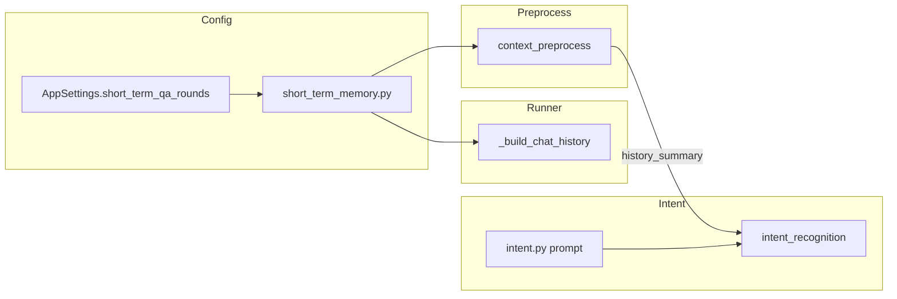

# T-015 五轮短期记忆窗口（F20）— 技术方案

> **任务 ID**：T-015  
> **依据文档**：`docs/PRD.md` §5.4、`docs/agent/langgraph-flow.md` §7.3、`.sdd/tasks.json`  
> **运行时**：项目根 `.venv/bin/python`；后端 `cd backend && PYTHONPATH=..`；端口 `8099`  
> **产出日期**：2026-06-15  
> **状态**：待 Developer 执行

---

## 1. 背景与目标

### 1.1 现状

| 位置 | 现状 | 问题 |
|------|------|------|
| `runner.py` `_build_chat_history` | `limit=10` 硬编码，对 `session.messages` 尾部截取 | 含当前 user 消息时，第 6 轮会截断不完整 QA 对（遗留 `a1` 孤儿） |
| `context_preprocess.py` | `_MAX_HISTORY_MESSAGES=12`、`_MAX_HISTORY_CHARS=800` 独立常量 | 与 runner 窗口不一致，非单一配置源 |
| `intent_recognition.py` | 已将 `history_summary` 传入 LLM payload | ✓ |
| `integrations/llm/prompts/intent.py` | 无 `history_summary` 使用说明与续问 few-shot | 续问无法可靠延续上轮意图 |
| `settings.py` | 无 `short_term_qa_rounds` | 无法 env 覆盖 |

### 1.2 目标

1. **单一配置源**：同一会话 Agent 仅消费最近 **5 轮 QA**（10 条 prior 消息）；`user_query` 单独承载当前轮。
2. **统一截断**：`LangGraphRunner` 与 `context_preprocess` 共用 `short_term_memory` 模块。
3. **Trace 对齐**：`context_preprocess` 输出可见 `history_count`、`history_summary` 及截断元数据。
4. **意图续问**：`intent.py` 明确要求结合 `history_summary` 解析短续问（如「一季报呢」→ `stock_analysis`）。

### 1.3 非目标（T-015 不做）

- 槽位跨轮继承（**T-016**）
- `slot_extraction` / 子 Agent / `response_assembly` 注入短期上下文（**T-017**）
- Query 改写 / `retrieval_query`（**T-014**）
- 长期记忆、跨会话画像（V2+）
- 前端 TracePanel 改造（P04 已通用渲染 `steps[].input/output`）

---

## 2. 窗口语义（产品规则）

```text
会话消息序：u1,a1, u2,a2, …, u5,a5, u6（当前，已入库）
user_query = u6 文本
chat_history = 最近 5 轮 prior QA = u1,a1,…,u5,a5（10 条）

第 7 轮：prior 含 6 轮 QA（12 条）→ 截断为 u2,a2,…,u6,a6（10 条），丢弃 u1,a1
```

**关键**：构建 `chat_history` 时须**先剥离尾部未回复的 user 消息**（当前轮），再按 `max_qa_rounds * 2` 截取 prior。

---

## 3. 架构与文件变更



### 3.1 新建 `backend/src/services/short_term_memory.py`

```python
DEFAULT_SHORT_TERM_QA_ROUNDS = 5
DEFAULT_HISTORY_SUMMARY_MAX_CHARS = 800
DEFAULT_HISTORY_SNIPPET_CHARS = 200

def short_term_message_limit(*, qa_rounds: int) -> int:
    return max(0, qa_rounds) * 2

def trim_chat_history(
    messages: list[dict[str, str]],
    *,
    max_qa_rounds: int,
    exclude_trailing_user: bool = True,
) -> tuple[list[dict[str, str]], dict[str, Any]]:
    """返回 (trimmed_history, meta)"""

def summarize_chat_history(
    history: list[dict[str, str]],
    *,
    max_chars: int = DEFAULT_HISTORY_SUMMARY_MAX_CHARS,
    snippet_chars: int = DEFAULT_HISTORY_SNIPPET_CHARS,
) -> str:
    """与现 _summarize_history 行为一致，但基于已截断 history"""
```

`meta` 字段（写入 `context_pack` 与 trace `output`）：

| 字段 | 说明 |
|------|------|
| `history_window_rounds` | 配置窗口（5） |
| `history_total_messages` | 会话 prior 消息总数（不含当前 user） |
| `history_truncated` | prior 是否被截断 |
| `history_count` | 进入 Agent 的消息条数（= len(chat_history)） |

### 3.2 修改 `backend/src/settings.py`

```python
short_term_qa_rounds: int = 5
```

`_ENV_FIELD_MAP` 增加：`"SHORT_TERM_QA_ROUNDS": "short_term_qa_rounds"`（可选 env 覆盖）。

同步 `backend/config/app.toml`、`backend/.env.example` 注释行（非必须改默认值）。

### 3.3 修改 `runner.py`

```python
from ...services.short_term_memory import trim_chat_history

def _build_chat_history(self, session: SessionRecord) -> list[dict[str, str]]:
    messages = [{"role": str(m.role), "content": m.content} for m in sorted(...)]
    trimmed, _ = trim_chat_history(
        messages,
        max_qa_rounds=self.settings.short_term_qa_rounds,
        exclude_trailing_user=True,
    )
    return trimmed
```

### 3.4 修改 `context_preprocess.py`

- 删除 `_MAX_HISTORY_MESSAGES`、本地 `_summarize_history`
- 对 `state.chat_history`（已由 runner 截断）调用 `summarize_chat_history`
- 若 runner 未截断（单测直接注入 state），在 preprocess 内二次 `trim_chat_history` 保底
- `_build_context_pack` 合并 `meta` 字段
- `run_node_with_trace` 的 `output` 保留 `history_summary`；`input_data` 增加 `history_truncated` 等便于 Trace 展示

### 3.5 修改 `integrations/llm/prompts/intent.py`

在 `INTENT_SYSTEM_PROMPT_BASE` 增加章节 **「多轮续问 / history_summary」**：

- 当 `user_payload` 含非空 `history_summary` 且当前 `normalized_query` 为短续问、指代或省略主语时，须结合历史判定主意图，**通常延续上轮 `intent_id`**
- 续问示例 few-shot（含 `history_summary` + `normalized_query` 输入形态说明）

示例：

```text
【多轮续问】
输入 JSON 含 history_summary（上轮对话摘要）与 normalized_query（本轮问题）。
当本轮为短续问（如「一季报呢」「估值呢」「那风险呢」）且 history_summary 显示上轮为个股/财报讨论时，intent_id 应为 stock_analysis。

history_summary:
user: 宁德时代基本面怎么样
assistant: （上轮摘要…）
normalized_query: 一季报呢
→ {"intent_id":"stock_analysis",...}
```

---

## 4. 测试计划

### 4.1 新建 `backend/tests/test_short_term_memory.py`

| 用例 | 断言 |
|------|------|
| `test_trim_keeps_five_rounds_on_sixth_turn` | 6 轮 prior（12 msg）→ 保留后 10 条，首条为 u2 |
| `test_trim_excludes_trailing_user` | `[u1,a1,u2]` + exclude → `[u1,a1]` |
| `test_summarize_respects_max_chars` | 超长 history → summary ≤ max_chars |
| `test_round_seven_drops_oldest_pair` | 7 轮 prior → u1,a1 不在结果中 |

### 4.2 扩展 `backend/tests/test_langgraph_trace.py` 或新建 intent 测试

| 用例 | 断言 |
|------|------|
| `test_intent_prompt_mentions_history_summary` | `INTENT_SYSTEM_PROMPT_BASE` 含续问规则关键词 |
| `test_intent_follow_up_with_mock_llm` | mock `call_intent_json` 返回 stock_analysis；验证 payload 含 `history_summary` |

### 4.3 集成（可选 smoke）

`context_preprocess` 单测：`history_count=10`、`history_truncated=True` 写入 trace output。

### 4.4 门禁命令

```bash
cd backend && PYTHONPATH=.. ../.venv/bin/python -m pytest backend/tests/test_short_term_memory.py backend/tests/test_langgraph_trace.py -q
cd backend && PYTHONPATH=.. ../.venv/bin/python -m ruff check backend/src/services/short_term_memory.py backend/src/agents/nodes/context_preprocess.py
```

---

## 5. 验收映射（tasks.json acceptanceCriteria）

| AC | 实现 / 验证 |
|----|-------------|
| 第 6 轮起仅保留 5 轮 QA | `trim_chat_history` 单测 + runner 调用 |
| Trace `context_preprocess` 可见 `history_count`、截断后 `history_summary` | trace output 字段；Tester 查 GET trace |
| 续问意图识别 | intent prompt few-shot + mock LLM 单测 |

---

## 6. 文档与状态更新（Developer 收尾）

- `.sdd/tasks.json`：T-015 `status` → `testing`（Developer 完成）/ `done`（用户门禁后）
- `.sdd/status.json`：`current_task` → `T-015`
- `.sdd/experience.md`：记录窗口截断须 exclude trailing user 的坑
- **不修改** `docs/PRD.md` / `docs/Plan.md` 产品描述（已与 5 轮一致）

---

## 7. 实施顺序（Developer Checklist）

1. [ ] `short_term_memory.py` + settings
2. [ ] `runner.py` 接入
3. [ ] `context_preprocess.py` 接入 + trace meta
4. [ ] `intent.py` 续问 prompt
5. [ ] 单测全绿
6. [ ] `.sdd/developer-reports/T-015-completion.md`（无密钥）
7. [ ] Git commit（message: `feat(T-015): 五轮短期记忆窗口与意图续问`)

---

## 8. 风险与注意

- **勿**把当前 user 消息重复放进 `chat_history`（`user_query` 已单独传递）
- `history_summary` 字符上限保持 800，避免 intent token 膨胀
- T-016 将在此基础上做 `pending_slots`，本任务勿提前实现槽位继承
