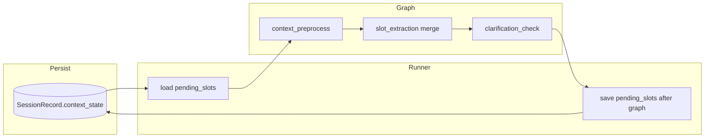

# T-016 会话 pending_slots 多轮闭环（F19）— 技术方案

> **任务 ID**：T-016  
> **依据文档**：`docs/PRD.md` §5.4、`docs/agent/langgraph-flow.md` §7.2、§7.3、`.sdd/tasks.json`  
> **前置**：T-015 五轮窗口（`short_term_memory`）已验收  
> **运行时**：项目根 `.venv/bin/python`；`cd backend && PYTHONPATH=..`；端口 `8099`  
> **产出日期**：2026-06-19  
> **状态**：待 Developer 执行

---

## 1. 背景与目标

### 1.1 Bad Case（BC-008 根因）

Trace `trace_20260619_230935_017_local`：

| 节点 | 结果 |
|------|------|
| `intent_recognition` | ✅ `stock_analysis`，`history_summary` 含宁德时代 |
| `slot_extraction` | ❌ 仅 `topic/event/time_range`，**无 `stock_name`** |
| `clarification_check` | 触发「核心槽位缺失：stock_name」 |

T-015 只修了意图层；**槽位未跨轮继承**。

### 1.2 目标

1. 会话级 **`pending_slots`**：上轮成功路由后持久化可继承槽位，本轮 `slot_extraction` 合并。
2. **`clarification_check`**：已继承且存在于 `slots` 的必填槽位**不计入** missing / 不触发澄清。
3. **显式覆盖**：本轮用户换新标的（如「泸州老窖呢」）时覆盖继承，不误用上轮公司。
4. **Trace 可观测**：`slot_extraction` / `clarification_check` 可见 `pending_slots`、合并前后对比、`inherited_slot_keys`。

### 1.3 非目标（T-016 不做）

- `response_assembly` / 子 Agent / RAG 注入（**T-017**）
- Query 改写（**T-014**）
- `slot_confidence` 低置信澄清阈值全量产品化（本任务仅预留配置常量，默认与现 `_CONFIDENCE_THRESHOLD` 对齐）
- 前端改造

---

## 2. 架构



### 2.1 持久化方案：`SessionRecord.context_state` JSON

新增列（SQLite 轻量迁移，`init_db` 后 `ALTER TABLE` 若列不存在）：

```python
context_state: Mapped[dict[str, Any]] = mapped_column(JSON, nullable=False, default=dict)
```

**`context_state` 结构**：

```json
{
  "pending_slots": { "stock_name": "宁德时代", "stock_code": "300750.SZ" },
  "pending_intent_id": "stock_analysis",
  "pending_slot_confidence": { "stock_name": 1.0 },
  "updated_at": "2026-06-19T23:09:28+08:00"
}
```

**写入时机**（`LangGraphRunner.run_stream` 图执行成功后）：

- `need_clarification == false`
- `intent_id` 为可继承意图（`stock_analysis` / `data_query` / `hotspot_analysis` / `document_qa`）
- 用合并后的 `slots` + `slot_confidence` 更新 `context_state`

**不写入 / 清空**：

- 走了 `clarification_response`（`need_clarification == true`）→ **保留**上轮 pending（用户补槽后仍可用）或按产品：**不更新** pending，避免用不完整 slots 覆盖
- `intent_id` 变为 `chit_chat` / `unknown` / `prediction_request` → **清空** pending
- 本轮合并检测到标的被显式覆盖 → 写入新 slots

> **决策**：澄清轮**不更新** pending；仅成功进入路由的轮次更新。避免 `一季报呢` 澄清轮把 pending 洗掉。

**读取时机**：`LangGraphRunner.run_stream` 构建 `initial_state` 时从 `session.context_state` 注入 `pending_slots`、`pending_intent_id`。

---

## 3. 新建 `backend/src/services/slot_memory.py`

单一配置源（满足 technicalChecks）：

```python
# 按意图可继承槽位（本轮未提及时从上轮 pending 补全）
INHERITABLE_SLOTS_BY_INTENT: dict[str, frozenset[str]] = {
    "stock_analysis": frozenset({"stock_name", "stock_code", "industry", "analysis_dimension"}),
    "data_query": frozenset({"industry", "metric", "market", "time_range", "trade_date"}),
    "hotspot_analysis": frozenset({"topic", "industry", "event", "time_range"}),
    "document_qa": frozenset({"document_id", "stock_name", "section"}),
}

# 按意图必填槽位（clarification_check 引用，从 clarification_check 迁出）
REQUIRED_SLOTS_BY_INTENT: dict[str, frozenset[str]] = {
    "stock_analysis": frozenset({"stock_name"}),  # stock_code 可选
    "data_query": frozenset({"metric"}),
    "document_qa": frozenset({"document_id"}),  # KB 可解析时例外保留现有逻辑
}

SLOT_CONFIDENCE_CLARIFY_THRESHOLD = 0.55  # 预留，T-016 默认不单独触发

def merge_pending_slots(
    *,
    intent_id: str,
    pending_slots: dict[str, Any],
    extracted_slots: dict[str, Any],
    pending_intent_id: str | None = None,
) -> tuple[dict[str, Any], list[str], list[str]]:
    """返回 (merged_slots, inherited_keys, overridden_keys)"""

def filter_missing_after_inherit(
    missing_slots: list[str],
    merged_slots: dict[str, Any],
    inherited_keys: list[str],
) -> list[str]

def should_clear_pending(*, new_intent_id: str, old_intent_id: str | None) -> bool

def build_context_state_from_run(
    *,
    intent_id: str,
    slots: dict[str, Any],
    slot_confidence: dict[str, float],
) -> dict[str, Any]
```

**合并规则**：

1. 若 `should_clear_pending`（意图切换到 chit_chat 等）→ `pending_slots` 视为 `{}`
2. 若 `pending_intent_id` 与当前 `intent_id` 不同但同属可继承族（如 stock_analysis 续问 data_query）→ **仅继承共有槽位**（如 `industry`）；`stock_analysis` 同意图时全量继承 `INHERITABLE_SLOTS_BY_INTENT[intent_id]`
3. `merged = pending.copy()` → 用 `extracted_slots` 非空值覆盖 → `inherited_keys` = pending 中未被覆盖且仍在 merged 的键
4. `enrich_stock_slots_from_kb` 在合并**后**对 merged query+slots 再跑（已有逻辑挪到 merge 之后）

**显式换标的**：若 `extracted_slots.stock_name` 非空且与 `pending_slots.stock_name` 不同 → 记 `overridden_keys`，以 extracted 为准（LLM 从「泸州老窖呢」抽取）

---

## 4. 节点改动

### 4.1 `state.py`

```python
pending_slots: dict[str, Any]
pending_intent_id: str
pending_slot_confidence: dict[str, float]
inherited_slot_keys: list[str]
active_slots: dict[str, Any]  # slot_extraction 输出 = merged，供下游与 T-017
```

### 4.2 `runner.py`

- 读 `session.context_state` → `initial_state["pending_slots"]` 等
- 图结束后若应持久化 → `session.context_state = build_context_state_from_run(...)`；若应清空 → `{}`
- `SessionRepository.update_session_context_state(session_id, context_state)`

### 4.3 `context_preprocess.py`

- 将 `pending_slots` / `pending_intent_id` 写入 `context_pack`（Trace 可见）
- 不改变 pending 内容

### 4.4 `slot_extraction.py`

**input_data 增加**：

```python
{
  "normalized_query": ...,
  "intent_id": ...,
  "context_pack": ...,
  "history_summary": state.get("history_summary", ""),
  "pending_slots": state.get("pending_slots") or {},
  "pending_intent_id": state.get("pending_intent_id", ""),
}
```

**流程**：

1. LLM 抽取 `extracted_slots`
2. `merge_pending_slots(...)`
3. `enrich_stock_slots_from_kb` / `enrich_trading_slots` 作用于 **merged**
4. `filter_missing_after_inherit` 清理 `missing_slots`
5. **output** 增加 trace 字段：

```python
{
  "extracted_slots": {...},
  "pending_slots": {...},
  "slots": merged,           # 下游沿用
  "active_slots": merged,
  "inherited_slot_keys": [...],
  "overridden_slot_keys": [...],
  ...
}
```

### 4.5 `integrations/llm/prompts/slots.py`

增加章节 **「多轮 pending_slots / history_summary」**：

- 输入含 `pending_slots` 时，本轮未提及的标的/行业可继承，**不要**列入 `missing_slots`
- 用户显式更换公司名时以本轮为准
- few-shot：`pending_slots: {stock_name: 宁德时代}` + `一季报呢` → slots 含 stock_name

### 4.6 `clarification_check.py`

- `_missing_core_slots` 改为引用 `slot_memory.REQUIRED_SLOTS_BY_INTENT`
- **input** 增加 `inherited_slot_keys`
- 若 `stock_name` 在 `slots` 中（含继承）→ 不加入 `missing_core`
- `missing_slots` 过滤：去掉已在 `slots` 中且有值的 inherited 项
- trace output 增加 `inherited_slot_keys` 回显

---

## 5. 数据库与仓储

### 5.1 `models.py`

`SessionRecord.context_state: JSON default {}`

### 5.2 `db/session.py` 或 `db/migrations.py`

```python
async def ensure_schema_columns():
    # PRAGMA table_info(investment_sessions); 若无 context_state 则 ALTER ADD COLUMN
```

`init_db()` 末尾调用。

### 5.3 `session_repository.py`

```python
async def update_context_state(self, session_id: str, context_state: dict) -> None
```

---

## 6. 测试计划

### 6.1 `backend/tests/test_slot_memory.py`（新建）

| 用例 | 断言 |
|------|------|
| merge 续问继承 stock_name | pending 宁德时代 + extracted 仅 time_range → merged 含 stock_name |
| 显式覆盖 | pending 宁德时代 + extracted 泸州老窖 → merged 泸州老窖 |
| filter_missing | inherited stock_name 不在 missing |
| clear on chit_chat | should_clear_pending true |

### 6.2 `backend/tests/test_slot_extraction_multiturn.py`（新建）

mock `call_intent_json`：

| 用例 | 断言 |
|------|------|
| 续问合并 | state 含 pending_slots → output.slots 含 stock_name |
| trace 字段 | inherited_slot_keys 非空 |

### 6.3 `backend/tests/test_clarification_inherited.py`（新建）

| 用例 | 断言 |
|------|------|
| 继承 stock_name 不澄清 | slots 含继承 stock_name → need_clarification false |
| 真缺失仍澄清 | 无 stock → need_clarification true |

### 6.4 回归

```bash
PYTHONPATH=. .venv/bin/python -m pytest \
  backend/tests/test_slot_memory.py \
  backend/tests/test_slot_extraction_multiturn.py \
  backend/tests/test_clarification_inherited.py \
  backend/tests/test_short_term_memory.py \
  backend/tests/test_langgraph_preprocessing.py -q
```

---

## 7. 验收映射

| AC | 实现 |
|----|------|
| 「一季报呢」含 stock_name=宁德时代 | merge + 不澄清 |
| 「泸州老窖呢」覆盖 | merge override |
| 真缺槽仍澄清 | REQUIRED_SLOTS + 无继承 |

---

## 8. 文档与收尾

- `.sdd/developer-reports/T-016-completion.md`
- `.sdd/experience.md`：澄清轮不覆盖 pending、SQLite ALTER 列
- `docs/agent/response-bad-case.md`：追加 **BC-008** 宁德时代续问澄清（已修）
- `.sdd/tasks.json` T-016 → `testing`
- `.sdd/status.json` → `T-016`
- Commit：`feat(T-016): 会话 pending_slots 多轮槽位继承`

---

## 9. Developer Checklist

1. [ ] `slot_memory.py` + REQUIRED/INHERITABLE 配置
2. [ ] `SessionRecord.context_state` + SQLite migrate
3. [ ] `runner` 读写 context_state
4. [ ] `slot_extraction` merge + trace 字段
5. [ ] `slots.py` 多轮 prompt
6. [ ] `clarification_check` 引用配置 + inherited 过滤
7. [ ] 单测全绿
8. [ ] BC-008 文档

---

## 10. 风险

- **服务端未重启**：联调前重启 8099
- **旧库无列**：必须跑 `ensure_schema_columns`
- **澄清轮写 pending**：禁止，否则可能持久化不完整 slots
