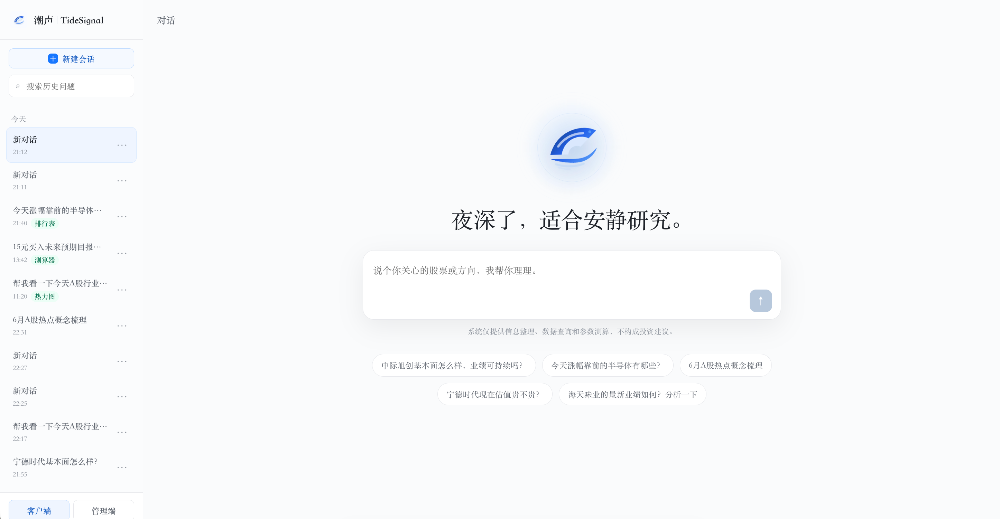
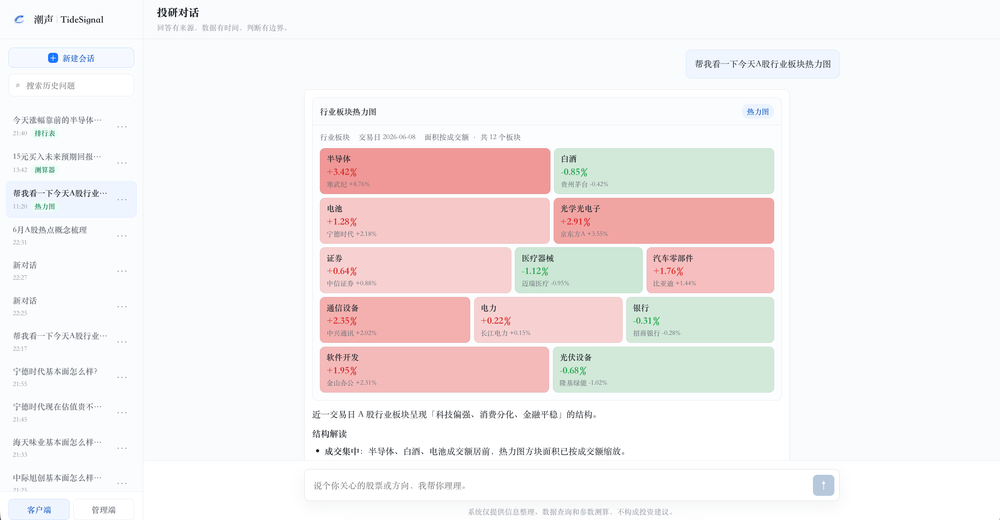
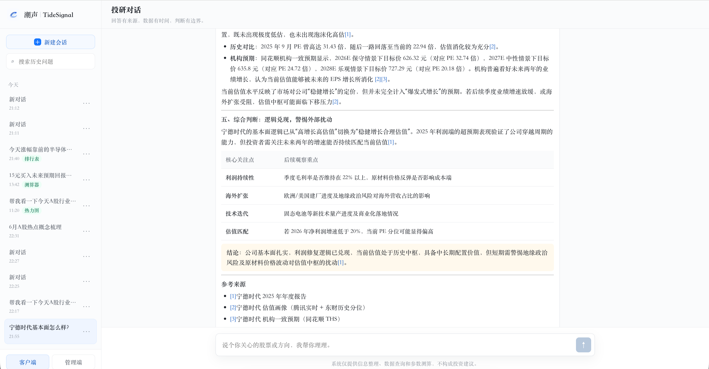
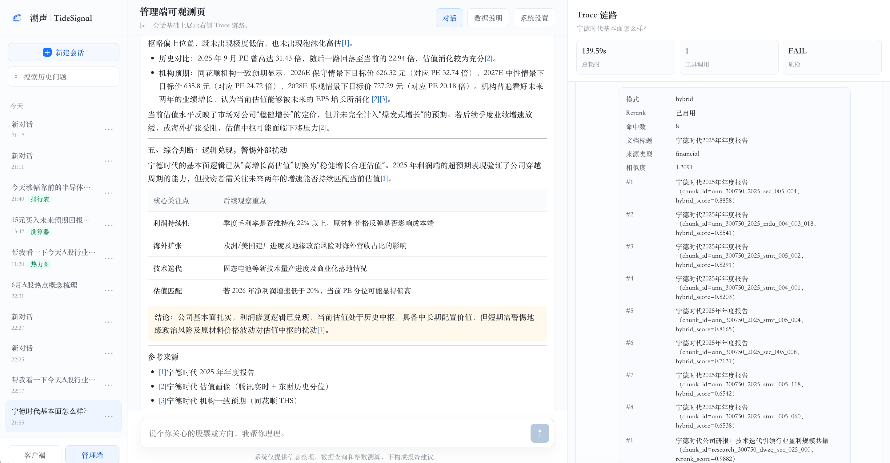
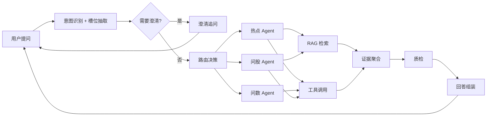

# 潮声 TideSignal · 智能投研

> 面向散户与投顾的 A 股投研对话助手：用自然语言问热点、问股、问数，系统按意图路由多 Agent，结合 RAG 与实时工具链生成可溯源、可交互的回答。

[](https://www.python.org/) [](https://fastapi.tiangolo.com/) [](https://react.dev/) [](https://langchain-ai.github.io/langgraph/)

[产品说明文档](docs/PRD.md) · [Agent 架构与流转](docs/agent/langgraph-flow.md) · [本地启动指南](docs/startup.md) · [公网部署指南](docs/deployment-demo.md)

---

## 这个项目解决什么问题

散户和投顾每天面对大量重复性投研问题：某只股票基本面如何、板块今天涨了多少、近期热点催化是什么、财报关键指标怎么读。信息分散在行情软件、研报、公告里，**问一句、等很久、还难核对来源**。

TideSignal 把这类问题收敛成一个对话入口：用户用口语提问，系统自动识别意图、补齐槽位、调用知识库与行情工具，以流式正文 + 富组件 + 参考来源返回。管理端可查看 Trace，便于验证链路与排查 Bad Case。

**面向谁**：散户（低门槛获取整理后的信息）、投顾（承接高频基础问答）、技术/产品观察者（可观测、可迭代的 Agent 架构参考）。

---

## 界面预览

### 客户端对话入口



### 行业板块热力图



### 问股分析回答



### 管理端 Trace 链路



---

## 核心功能

| 功能 | 说明 |
|------|------|
| **意图识别与路由** | LangGraph 识别热点 / 问数 / 问股等意图，路由到对应子 Agent 与工具链 |
| **RAG 检索与溯源** | 本地知识库（财报、研报、热点月报）混合召回 + 可选 Rerank；正文与参考来源对齐，覆盖约 55 家 A 股标的 |
| **问数工具链** | 东财 push2 排行 / 热力图、交易日历锚点、成交额等；失败降级 demo 截面并标注口径 |
| **问股实时工具** | 新浪财报、一致预期、东财研报元数据、巨潮公告组合基本面画像；Trace 含 `data_source` 归因 |
| **答案质检与组装** | 合规扫描、引用完整性、数据一致性；分级 `assembly_profile` 流式组装 |
| **多轮对话** | 近 5 轮短期记忆、槽位继承、Query 改写与多路检索，连续追问无需重复全称 |
| **可观测 Trace** | 节点级执行链路、工具耗时、Prompt 统计，管理端右侧面板可见 |
| **公网 Demo 额度** | 访客 UUID + 每日 5 次提问（可配置），防止 LLM 成本滥用 |

---

## 产品流程



### 支持的意图类型

| 意图 | 典型问题 | 主要数据源 |
|------|----------|-----------|
| 热点解读 | "为什么最近商业航天这么火？" | 同花顺热点、东财资讯、本地月报 |
| 问数查询 | "近一周涨幅前五的机器人概念股？" | 东财 push2 排行 |
| 问股分析 | "宁德时代基本面怎么样？" | 新浪财报、腾讯报价、东财研报 |
| 闲聊 | "你好" | LLM 直接回复 |

完整节点定义与分支条件见 [`docs/agent/langgraph-flow.md`](docs/agent/langgraph-flow.md)。

---

## 技术架构

```text
┌─────────────────────────────────────────────────────────────┐
│  Frontend (Vercel / 本地 Vite)                               │
│  React 19 · TypeScript · Ant Design · Zustand · SSE 流式消费  │
│  富组件：ranking_table / sector_heatmap / calculator          │
└───────────────────────────┬─────────────────────────────────┘
                            │ REST + SSE (/api/chat/*)
┌───────────────────────────▼─────────────────────────────────┐
│  Backend (Render / Railway / 本地 uvicorn)                    │
│  FastAPI (PyCore) · SQLite · Demo 额度计数                    │
└───────────────────────────┬─────────────────────────────────┘
                            │
        ┌───────────────────┼───────────────────┐
        ▼                   ▼                   ▼
  LangGraph 编排      RAG Service          外部工具
  意图/槽位/路由      BM25+向量+Rerank      东财行情、同花顺热点
  质检/组装           本地 KB ~55 家标的    新浪财报、巨潮公告…
        │                   │                   │
        └───────────────────┴───────────────────┘
                            │
                            ▼
                   SiliconFlow LLM / Embedding
                   （意图、主输出、向量化、Rerank）
```

| 层 | 技术选型 |
|----|----------|
| 前端 | React 19、TypeScript、Vite、Ant Design |
| 后端 | Python 3.11+、FastAPI、LangGraph |
| 数据 | SQLite（会话 / 消息 / Trace / 额度）、本地知识库 |
| 模型 | SiliconFlow：DeepSeek-V3（意图）、Qwen（主输出）、BGE（Embedding / Rerank） |

**仓库结构**

```text
smart-investment-research/
├── backend/          # FastAPI + LangGraph + 工具链 / RAG
├── frontend/         # 客户端 / 管理端 UI
├── pycore/           # 共享框架（API 客户端、LLM 封装、DB）
├── docs/             # PRD、API 契约、Agent 文档、部署说明
└── assets/           # 截图 / GIF
```

---

## 快速开始

默认端口：**前端 5199**，**后端 8099**。

```bash
# 1. 安装依赖
python3 -m venv .venv && source .venv/bin/activate
pip install -e ".[dev]"
cd frontend && npm install && cd ..

# 2. 配置环境变量
cp backend/.env.example backend/.env
# 编辑 backend/.env：填写 SiliconFlow API Key（LLM + Embedding）

# 3. 启动后端
cd backend && PYTHONPATH=.. ../.venv/bin/python -m uvicorn src.main:app --host 127.0.0.1 --port 8099

# 4. 启动前端（另开终端）
cd frontend && npm run dev -- --host 127.0.0.1 --port 5199
```

浏览器访问 http://127.0.0.1:5199

- 前端默认通过 Vite 代理将 `/api` 转发到后端 8099；
- 连接真实后端时，确认 `frontend/.env` 中 `VITE_USE_MOCK=false`；
- 公网部署（Vercel + Render/Railway）：见 [`docs/deployment-demo.md`](docs/deployment-demo.md)。

---

## 设计决策

**为什么是对话，而不是又一个行情页？**  
投研问题往往是「带着上下文的一句人话」。对话降低门槛，但单靠大模型会幻觉、越界给投资建议。因此采用 Agent 路由 + 工具/RAG 约束 + 质检，把「能说什么」和「数据从哪来」写进链路。

**为什么强调可观测？**  
金融场景里「答对了」不够，还要能解释「怎么答的」。Trace 面板服务于内部验收、Bad Case 归因和演示可信度，与 C 端简洁体验并行。

| 取舍点 | 选择 | 原因 |
|--------|------|------|
| 数据获取 | 本地 KB + 有限 live API，失败降级 demo 数据并标注口径 | MVP 可控成本；禁止将 mock 数据冒充实时行情 |
| 合规边界 | 不做买卖建议、目标价；收益测算仅工具化公式 | 定位为信息整理与参数测算，非投顾牌照产品 |
| 多轮记忆 | 5 轮短期记忆 + 槽位继承，不做无限上下文 | 控制 Token 与槽位漂移，便于回归测试 |
| 公网额度 | 访客每日 5 次提问 | 控制 LLM 成本，保留完整链路体验 |

---

## 文档索引

| 文档 | 说明 |
|------|------|
| [`docs/startup.md`](docs/startup.md) | 本地启动、端口、Mock 开关、外部服务配置 |
| [`docs/deployment-demo.md`](docs/deployment-demo.md) | Vercel + Render/Railway 公网部署 |
| [`docs/api-contracts.md`](docs/api-contracts.md) | HTTP API 契约 |
| [`docs/agent/README.md`](docs/agent/README.md) | Agent 资料索引 |
| [`docs/agent/langgraph-flow.md`](docs/agent/langgraph-flow.md) | LangGraph 节点定义与流转图 |
| [`docs/agent/response-bad-case.md`](docs/agent/response-bad-case.md) | 回答质量 Bad Case 与修复记录 |

---

## 免责声明

本项目为投研**信息整理与参数测算**工具，**不构成任何投资建议**。行情与研报引用以正文及参考来源为准；`is_mock=true` 或降级数据须在正文中标注演示 / 模拟口径。
