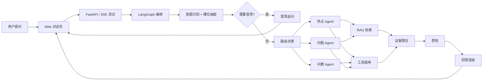

# 潮声 TideSignal · 智能投研

> 面向散户与投顾的 **A 股智能投研对话**产品：用自然语言问热点、问股、问数、读文档，系统按意图路由多 Agent，结合 RAG 与实时工具链生成可溯源、可交互的回答。

[在线体验 Demo](#)（Vercel 部署后更新） · [产品说明文档](docs/PRD.md) · [Agent 架构与流转](docs/agent/langgraph-flow.md) · [公网部署指南](docs/deployment-demo.md)

---

## 01. Demo Preview

主界面：左侧会话历史、中间流式对话、底部固定输入框；问数/问股场景可渲染排行表、板块热力图、收益率测算器等富组件。

> 截图/GIF 待补充：将主界面录屏或截图放入 `assets/demo-preview.gif` 后，下方引用即可生效。


---

## 02. 这个项目解决什么问题？

散户和投顾每天面对大量重复性投研问题：某只股票基本面如何、板块今天涨了多少、近期热点催化是什么、财报关键指标怎么读。信息分散在行情软件、研报、公告和记忆里，**问一句、等很久、还难核对来源**。

TideSignal 把这类问题收敛成**一个对话入口**：用户用口语提问，系统自动识别意图、补齐槽位、调用知识库与行情工具，再以流式正文 + 富组件 + 参考来源返回。管理端可查看 Trace，便于验证链路与排查 Bad Case。

**面向谁**：散户（低门槛获取整理后的信息）、投顾（承接高频基础问答）、产品/技术观察者（可观测、可迭代）。

---

## 03. 核心功能

| 功能 | 说明 | Demo 展示 |
|------|------|-----------|
| **意图识别与路由** | LangGraph 识别热点 / 问数 / 问股 / 文档问答等，路由到对应子 Agent 与工具链 | 问「半导体涨幅排行」「宁德时代基本面」「6 月热点」可见不同回答形态 |
| **RAG 检索与溯源** | 本地知识库（财报、研报、热点月报等）混合召回 + 可选 Rerank；正文与 `### 参考来源` 对齐 | 问股/热点回答附带文档片段与路径归因 |
| **问数工具链** | 东财 push2 排行/热力图、交易日历锚点、成交额等；失败降级 demo 截面并标注口径 | 排行表 `ranking_table`、热力图 `sector_heatmap` |
| **问股 live Tool** | 新浪财报、一致预期、东财研报元数据、巨潮公告等组合基本面画像 | Trace 含 `data_source` 归因 |
| **答案质检与组装** | 合规扫描、引用完整性、数据一致性；分级 `assembly_profile` 流式组装 | 管理端 Trace 可见 `quality_check` 节点 |
| **多轮对话** | 近 5 轮短期记忆、槽位继承、Query 改写与多路检索 | 连续追问同一标的无需重复全称 |
| **可观测 Trace** | 节点级执行链路、工具耗时、Prompt 统计 | 管理端右侧面板 |
| **公网 Demo 额度** | 访客 UUID + 每日 5 次提问（可配置） | 输入框下方显示剩余次数 |

---

## 04. 产品流程

### 核心链路



### 节点说明

| 节点 | LangGraph ID | 说明 |
|------|-------------|------|
| 意图识别 + 槽位抽取 | `intent_recognition` + `slot_extraction` | 识别用户问题类型（热点/问数/问股/闲聊），抽取关键槽位（标的、时间、指标等） |
| 澄清追问 | `clarification_response` | 意图不明确或槽位缺失时，生成结构化追问 |
| 路由决策 | `routing_decision` | 根据意图和槽位选择对应的 Agent 链路 |
| 热点 Agent | `hotspot_agent` | 处理市场热点、概念异动、政策事件等问题 |
| 问数 Agent | `data_query_agent` | 处理排行、涨跌幅、指标查询等问题 |
| 问股 Agent | `stock_analysis_agent` | 处理个股基本面、财报、估值等问题 |
| RAG 检索 | `rag_retrieval` | 从本地知识库检索相关财报、研报、热点月报等 |
| 工具调用 | `tool_call` | 调用外部数据源（东财行情、新浪财报、同花顺热点等） |
| 证据聚合 | `evidence_merge` | 整合工具结果和 RAG 检索结果 |
| 质检 | `quality_check` | 合规扫描、引用完整性、数据一致性检查 |
| 回答组装 | `response_assembly` | 生成流式 Markdown 回答，含引用和风险提示 |

### 支持的意图类型

| 意图 | 典型问题 | 主要数据源 |
|------|----------|-----------|
| 热点解读 | "为什么最近商业航天这么火？" | 同花顺热点、东财资讯、本地月报 |
| 问数查询 | "近一周涨幅前五的机器人概念股？" | 东财 push2 排行 |
| 问股分析 | "宁德时代基本面怎么样？" | 新浪财报、腾讯报价、东财研报 |
| 闲聊 | "你好" | LLM 直接回复 |

> **完整流转图**：详细的节点定义、分支条件与 Trace 映射见 [`docs/agent/langgraph-flow.md`](docs/agent/langgraph-flow.md)。

---

## 05. 技术架构

```text
┌─────────────────────────────────────────────────────────────┐
│  Frontend (Vercel / 本地 Vite)                               │
│  React 19 · TypeScript · Zustand · SSE 流式消费               │
│  富组件：ranking_table / sector_heatmap / calculator          │
└───────────────────────────┬─────────────────────────────────┘
                            │ REST + SSE (/api/chat/*)
┌───────────────────────────▼─────────────────────────────────┐
│  Backend (Render / Railway / 本地 uvicorn)                     │
│  FastAPI (PyCore) · SQLite · Demo 额度计数                    │
└───────────────────────────┬─────────────────────────────────┘
                            │
        ┌───────────────────┼───────────────────┐
        ▼                   ▼                   ▼
  LangGraph 编排      RAG Service          外部工具
  意图/槽位/路由      BM25+向量+Rerank      东财行情、同花顺热点
  质检/组装           本地 KB ~55 家标的    新浪财报、巨潮公告…
        │                   │                   │
        └───────────────────┴───────────────────┘
                            │
                            ▼
                   SiliconFlow LLM / Embedding
                   （意图、主输出、向量化、Rerank）
```

| 层 | 技术 |
|----|------|
| 前端 | React 19、TypeScript、Vite、Ant Design |
| 后端 | Python 3.11+、FastAPI（PyCore）、LangGraph |
| 数据 | SQLite（会话/消息/Trace/额度）、`backend/data/knowledge-base/` |
| 模型 | SiliconFlow：DeepSeek-V3（意图）、Qwen3.5（主输出）、bge（Embedding/Rerank） |

**仓库结构**

```text
smart-investment-research/
├── backend/          # FastAPI + LangGraph + 工具/RAG
├── frontend/         # 客户端 / 管理端 UI
├── pycore/           # 共享框架（API、LLM、DB）
├── docs/             # PRD、API 契约、Agent 文档、部署说明
├── assets/           # README 用截图/GIF（待补充）
└── .sdd/             # SDD 任务状态与测试报告
```

---

## 06. 如何运行

默认端口：**前端 5199**，**后端 8099**。完整说明见 [`docs/startup.md`](docs/startup.md)。

```bash
# 1. 依赖
python3 -m venv .venv && source .venv/bin/activate
pip install -e ".[dev]"
cd frontend && npm install && cd ..

# 2. 配置
cp backend/.env.example backend/.env
# 编辑 backend/.env：LANGGRAPH_ENV=local，并填写 LLM / Embedding Key

# 3. 启动后端
cd backend && PYTHONPATH=.. ../.venv/bin/python -m uvicorn src.main:app --host 127.0.0.1 --port 8099

# 4. 启动前端（另开终端）
cd frontend && npm run dev -- --host 127.0.0.1 --port 5199
```

浏览器访问：http://127.0.0.1:5199

- 联调真实后端：`frontend/.env` 中 `VITE_USE_MOCK=false`（默认走 Vite 代理 `/api` → 8099）。
- 公网 Demo 部署（Vercel + Render/Railway）：见 [`docs/deployment-demo.md`](docs/deployment-demo.md)。

---

## 07. 我的产品思考

**为什么是对话，而不是又一个行情页？**  
投研问题往往是「带着上下文的一句人话」，而不是先选指标再填参数。对话降低门槛，但单靠大模型会幻觉、会越界给投资建议。因此采用 **Agent 路由 + 工具/RAG 约束 + 质检**，把「能说什么」和「数据从哪来」写进链路，而不是事后补救。

**为什么强调可观测？**  
金融场景里「答对了」不够，还要能解释「怎么答的」。Trace 面板服务于内部验收、Bad Case 归因和对外演示时的可信度，与 C 端简洁体验并行：客户端只看结果，管理端看过程。

**关键取舍**

| 取舍 | 选择 | 原因 |
|------|------|------|
| 数据 | 本地 KB + 有限 live API，失败可降级 demo | MVP 可控成本；必须标注 `is_mock` / 口径，禁止冒充实时行情 |
| 合规 | 不做买卖建议、目标价；测算仅工具化公式 | 定位为信息整理与参数测算，非投顾牌照产品 |
| 组装 | `assembly_profile` 分级：纯表格可模板短路，问股全文流式 | 平衡首字延迟与引用完整性（T-025～T-028） |
| 多轮 | 5 轮短期记忆 + 槽位继承，不做无限上下文 | 控制 Token 与槽位漂移，优先可测可回归 |
| 公网 Demo | 每日 5 次额度 | 控制 LLM 成本与滥用，仍保留完整链路体验 |

**怎么评估质量**

- **自动化**：`backend/tests/` 回归（API、LangGraph、交易日历、Demo 额度等）。
- **Bad Case 闭环**：[`docs/agent/response-bad-case.md`](docs/agent/response-bad-case.md) 记录现象 → 归因 → 修复 → 回归。
- **用户门禁**：关键任务（如 T-019、T-028）需用户验收通过后才标 `done`。
- **Trace 指标**：`prompt_stats`、`llm_passes`、工具 `data_source`、质检 `PASS/FAIL`。

---

## 版本演进

### V1.1（`ed52d93`）

- 问热点 / 问股 / 问数 / 文档问答：LangGraph 意图识别 → 路由 → RAG + 工具链 → 流式组装
- 富组件：`ranking_table`、`sector_heatmap`、`calculator`、`scenario_calculator`
- Trace 可观测；本地知识库 RAG

### V1.2 及后续（`main` 持续迭代）

在 V1.1 基础上已落地：

- **回答过程时间线**（T-020）：流式开始前可折叠的执行过程展示
- **问数 / 问股 / 热点深化**（T-021～T-024）：估值分位、财务深度、热点工具、KB ingest 刷新
- **知识库扩容**（T-019）：创业板 50 家新浪财报入库（叠加 T-024，RAG 覆盖约 **55 家** A 股标的）
- **多轮对话**（T-015～T-017）：五轮短期记忆、槽位继承、下游上下文注入
- **Query 改写**（T-014 / T-014-P2）：检索 query passthrough + 维度多路检索
- **问股 live 基本面 Tool**（T-018）：新浪财报、一致预期、研报元数据、巨潮公告；Trace 含数据来源归因
- **回答组装性能**（T-025）：`assembly_profile` 分级、首稿流式、citation 程序补标、纯排行/热力图模板短路
- **问数默认路由**（T-026）：排行/热力图/成交额等自然语言自动 enrich，减少误澄清（BC-010）
- **Citation 区 compact / 加固**（T-027～T-028）：缩短 prefill、段落级补标、hybrid snippet 800 字
- **交易日历**（BC-011）：法定休市日与显式 `trade_date`，修复节假日涨幅排行口径
- **东财 httpx + 热力图编排**（BC-012）
- **公网 Demo 部署与额度**（`ac625dd`）：Dockerfile、Vercel/Railway(Render) 指南、访客每日 5 次提问

**V1.2++ 里程碑**：T-019、T-025～T-028 均已通过 Developer / Tester / 用户门禁（验收记录见 `.sdd/test-reports/acceptance-T-019-result.md`、`acceptance-T-028-result.md`）。

### 版本检查点（回滚用）

| 代号 | 提交 | 说明 |
|------|------|------|
| **V1.1** | `ed52d93` | 流式输出、富组件示例与侧栏标签、年报澄清修复（BC-007）等 |
| **V1.2** | `7485f74` | 回答过程时间线、问数 P1 真实 API、移除问数 Mock 等 |
| **V1.2+** | `75aa4ec` | 多轮记忆（T-015～T-017）、Query 改写（T-014）、问股 live Tool（T-018）、热点/财务深化与 KB 扩容（T-021～T-024） |
| **V1.2++** | `0d092de` | T-019 KB 扩容、T-025～T-028 回答组装与 citation；**用户验收 2026-06-20** |
| **Demo 部署** | `ac625dd` | 公网部署配置、访客每日额度、部署文档 |

回滚到某一检查点（**会丢弃之后所有本地未推送改动，慎用**）：

```bash
git fetch origin
git reset --hard <提交哈希>   # 例如 ed52d93、7485f74、75aa4ec、ac625dd
```

当前 `main` 最新提交 **`ac625dd`**；SDD 验收状态与 `.sdd/status.json` 随推送同步。

**可选下一迭代**（见 [`docs/agent/tool-richness-roadmap.md`](docs/agent/tool-richness-roadmap.md)）：T-020-P2/P3 问数历史区间、T-021-P2/P3 估值同行对比、端到端性能优化。

---

## 文档索引

| 文档 | 说明 |
|------|------|
| [`docs/startup.md`](docs/startup.md) | 本地启动、端口、Mock、外部服务 |
| [`docs/deployment-demo.md`](docs/deployment-demo.md) | Vercel + Render/Railway 公网部署 |
| [`docs/api-contracts.md`](docs/api-contracts.md) | HTTP API 契约 |
| [`docs/agent/README.md`](docs/agent/README.md) | Agent 资料索引 |
| [`docs/agent/langgraph-flow.md`](docs/agent/langgraph-flow.md) | LangGraph 节点与流转图 |
| [`docs/agent/response-bad-case.md`](docs/agent/response-bad-case.md) | 回答质量 Bad Case 与修复记录 |

---

## 许可证与免责

本项目为投研**信息整理与参数测算**工具，**不构成投资建议**。行情与研报引用以正文及参考来源为准；`is_mock=true` 或降级数据须在正文中标注演示/模拟口径。
