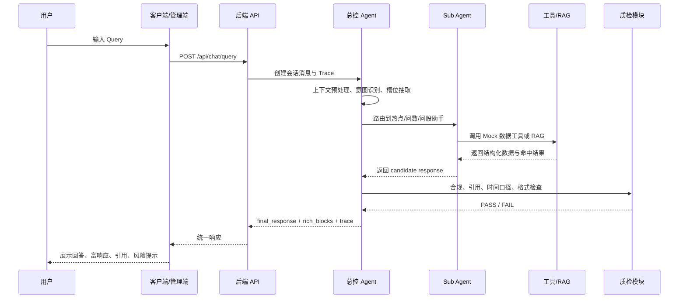
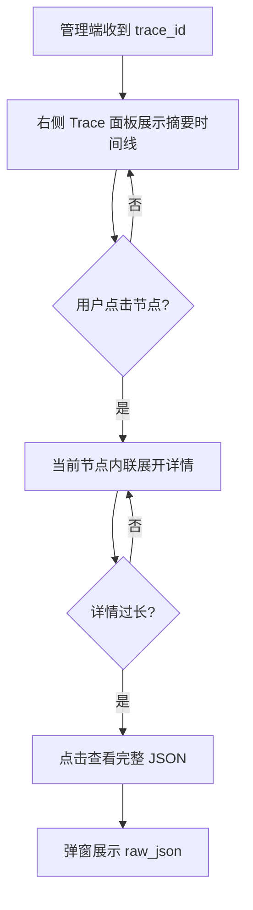
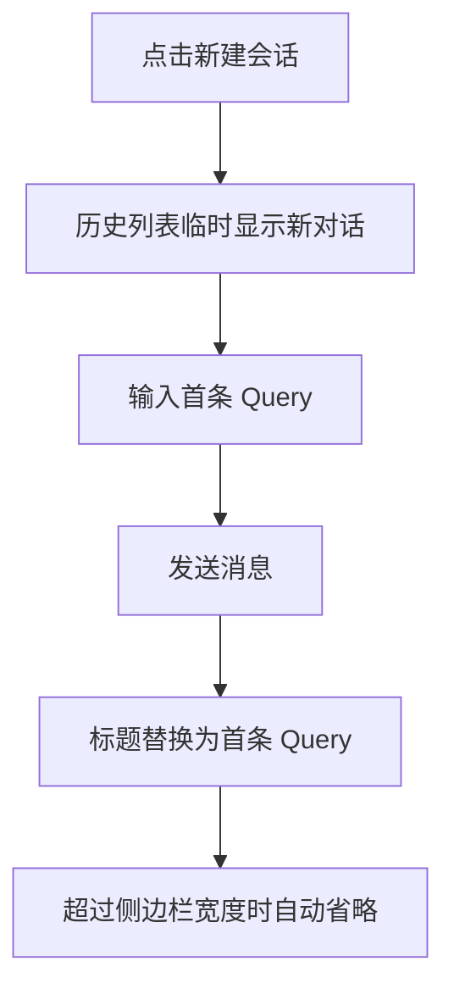

# 智能投研 PRD

## 1. 背景与调研结论

### 1.1 项目目标

智能投研是一个桌面 Web 端多 Agent 投研问答系统，面向散户、投顾和产品/技术侧观察者，提供自然语言投研问答、Agent 路由编排、本地 RAG/Mock 数据调用和可解释 Trace 链路。

系统目标包括：

- 降低散户获取和理解投研信息的门槛。
- 帮助投顾减少高频重复问答，把精力转向高价值咨询。
- 通过管理端可观测视图展示 Agent 流转过程，便于内部验证、链路说明和调试。
- 在 MVP 阶段优先完成前端体验、Mock Trace、富响应组件和本地数据演示，不依赖真实金融数据接口。

### 1.2 目标用户

| 角色 | 目标 | 关注点 |
|------|------|--------|
| 散户 | 用自然语言查询个股、行业、热点、财务指标等信息 | 回答清晰、有依据、有风险提示 |
| 投顾 | 用系统承接高频基础问答 | 提升服务效率，减少重复解释 |
| 管理员 / 产品运营 / 技术观察者 | 查看 Agent 链路、工具调用、RAG 命中和质检状态 | 系统流转透明、便于排查和讲解 |
| 项目维护者 | 维护 Prompt、Mock 数据、知识库和后端 LangGraph 流程 | 配置清楚，链路可替换 |

### 1.3 核心使用场景

- 盘中异动查询：个股或板块突然涨跌，快速查询基本面、财务数据、近期新闻和可能驱动。
- 个股研究：了解某只股票的公司概况、业务构成、财务指标、股东信息、公告和研报观点。
- 行业研究：了解行业整体表现、龙头公司、相关概念股和政策事件影响。
- 财报解读：财报发布后快速获取关键指标、同比环比变化和亮点风险。
- 新闻跟踪：重大政策或事件发生时，了解相关行业、概念股、历史案例和潜在影响。
- 参数测算：用户给出买入价、卖出价、持仓数量或情景参数后，系统生成收益率、盈亏、变化率等交互式测算组件。

### 1.4 竞品与参考方向

阶段 R 已完成视觉和产品参考调研，并选定融合方案：

- B 为主：客户端参考 ChatGPT 式低门槛对话体验。
- C 增强：管理端参考 Agent Trace / Observability 工作台，展示多 Agent 流转过程。
- A 做金融质感参考：借鉴 Wind / 同花顺 iFinD 的专业、克制、高信息密度。

调研证据已写入：

```text
.sdd/tmp/visual-research.md
.sdd/tmp/visual-evidence/
```

## 2. 页面清单与跳转逻辑

### 2.1 页面清单

| 序号 | 页面名称 | 页面类型 | 可见角色 | 入口来源 | 跳转去向 |
|------|----------|----------|----------|----------|----------|
| P01 | 客户端对话页 | 对话页 | 散户、投顾 | 默认入口 / 客户端 URL | 历史会话、当前对话 |
| P02 | 管理端可观测页 | 对话页 + Trace 工作台 | 管理员、产品运营、技术观察者 | 管理端 URL | 历史会话、当前对话、Trace 详情 |
| P03 | 会话历史视图 | 列表 / 侧边栏视图 | 客户端用户、管理端用户 | 左侧会话列表 | 客户端对话页 / 管理端可观测页 |
| P04 | Trace 详情面板 | 详情面板 | 管理端用户 | 管理端右侧 Trace 区 / 点击某轮问答 | 当前问答的 Trace 节点详情 |
| P05 | 本地知识库 / Mock 数据说明页 | 配置说明页 | 管理端用户 | 管理端导航 / 设置入口 | 返回管理端可观测页 |
| P06 | 系统设置页 | 设置页 | 管理端用户 | 管理端导航 | 模型配置、Mock 数据配置、合规规则配置 |

### 2.2 页面跳转图

```text
客户端入口
  -> P01 客户端对话页
      -> P03 会话历史视图
      -> 当前会话问答

管理端入口
  -> P02 管理端可观测页
      -> P03 会话历史视图
      -> 当前会话问答
      -> P04 Trace 详情面板
      -> P05 本地知识库 / Mock 数据说明页
      -> P06 系统设置页
```

### 2.3 全局布局规则

客户端：

- 左侧为会话历史。
- 中间为当前对话区。
- 底部为固定 / 悬浮输入框，参考 ChatGPT Web 端。
- 回答区展示引用依据、数据时间和风险提示。

管理端：

- 左侧为会话历史。
- 中间为当前对话区，与客户端同步 Query、Response 和历史记录。
- 右侧为 Trace 链路面板。
- 顶部或轻量导航进入 Mock 数据说明、系统设置。

导航可见性：

- 客户端顶部只保留对话与数据说明入口，不暴露系统设置。
- 管理端顶部可进入对话、数据说明和系统设置。

前端硬约束：

- 输入框必须固定在对话主区底部，不得被历史列表或消息流顶出视口。
- 左侧历史列表、中间消息区、右侧 Trace 面板均使用独立滚动容器。
- 新会话在用户发送首条 Query 前，可以临时显示为“新对话”；用户发送首条 Query 后，会话历史标题必须自动替换为该 Query。
- 会话标题规则：标题文本使用首条 Query；当标题超过会话历史列宽时，由前端按容器宽度自动显示省略号，不按固定字数截断。
- 会话历史列支持拖拽调整宽度；拖拽时中间对话区和底部输入框必须保持稳定，不得出现遮挡、跳动或溢出。
- 管理端右侧 Trace 面板支持拖拽调整宽度；拖拽时中间对话区、Trace 节点卡和底部输入框必须保持稳定，不得出现遮挡、跳动或溢出。
- 消息气泡不得写死固定宽高，必须根据内容自适应；短文本保持短气泡，长文本在最大宽度内自动换行。
- AI 回复支持富响应组件，不把表格、卡片、Trace、引用、风险提示全部硬塞进普通气泡。
- 富响应组件包括个股卡、财务表、行情排行表、引用列表、风险提示条、Trace 节点卡、工具调用结果卡、交互式投研计算组件。

## 3. 主要功能定义与分析

### 3.1 页面：P01 客户端对话页

#### 功能清单

| 功能编号 | 功能名称 | 一句话描述 | 用户可感知的完成标准 |
|----------|----------|------------|----------------------|
| F-01-01 | 会话历史 | 左侧展示历史会话，可新建、切换、搜索 | 用户能看到历史列表，点击后恢复对应问答 |
| F-01-02 | 对话输入 | 底部固定输入框，参考 ChatGPT | 历史再多也不会把输入框顶出页面 |
| F-01-03 | 智能问答 | 用户输入投研问题后获得回答 | 问热点、问数、问股都能得到结构化回复 |
| F-01-04 | 富响应组件 | 按内容展示表格、卡片、引用、风险提示 | 排行榜显示表格，个股问题显示信息卡 |
| F-01-05 | 交互式计算组件 | 支持收益率、盈亏、指标等参数测算 | 用户修改买入价后，测算结果实时变化 |
| F-01-06 | 引用与风险提示 | 展示数据来源、时间、合规提示 | 每个投研回答都能看到来源和“不构成投资建议” |

#### 功能边界

| 功能编号 | 包含 | 不包含 |
|----------|------|--------|
| F-01-01 | 会话新建、切换、搜索、本地历史 | 多账号云同步 |
| F-01-02 | 固定底部输入框、独立滚动消息区 | 输入框随消息流滚动 |
| F-01-03 | Mock / LangGraph 流程返回回答 | 真实交易、下单 |
| F-01-04 | 表格、卡片、来源、Trace 摘要类组件 | 任意复杂低代码组件生成 |
| F-01-05 | 用户给参数后的测算 | 主动推荐买入价、目标价、仓位 |
| F-01-06 | 来源、时间、风险提示 | 合规审计后台 |

### 3.2 页面：P02 管理端可观测页

#### 功能清单

| 功能编号 | 功能名称 | 一句话描述 | 用户可感知的完成标准 |
|----------|----------|------------|----------------------|
| F-02-01 | 客户端会话同步 | 同步客户端 Query、Response、历史记录 | 客户端问完后，管理端能看到同一轮问答 |
| F-02-02 | 管理端对话 | 管理端也可直接输入 Query | 管理端发问后同样生成回答和 Trace |
| F-02-03 | 右侧 Trace 链路 | 展示 Agent 完整流转过程 | 能看到预处理、意图、槽位、路由、工具、质检 |
| F-02-04 | 节点状态展示 | 展示每个节点的状态、耗时、输入输出摘要 | 节点有 pending / running / success / failed 状态 |

#### 功能边界

| 功能编号 | 包含 | 不包含 |
|----------|------|--------|
| F-02-01 | 同一应用内同步同一会话数据 | 多设备实时同步 |
| F-02-02 | 管理端发问 | 完整角色权限系统 |
| F-02-03 | Trace 可视化 | 完整 LLMOps 观测平台 |
| F-02-04 | 节点状态、耗时、摘要、详情 | 生产级告警 |

### 3.3 页面：P03 会话历史视图

#### 功能清单

| 功能编号 | 功能名称 | 一句话描述 | 用户可感知的完成标准 |
|----------|----------|------------|----------------------|
| F-03-01 | 历史列表 | 展示最近会话 | 用户能按标题和时间找到历史 |
| F-03-02 | 会话搜索 | 搜索历史 Query / 标题 | 输入关键词能过滤历史 |
| F-03-03 | 独立滚动 | 历史列表自己滚动 | 历史再多也不影响输入框和主对话区 |
| F-03-04 | 自动会话命名 | 新会话发送首条 Query 后自动生成会话标题 | 新会话发送前显示“新对话”，发送后标题能反映用户问题 |
| F-03-05 | 会话删除 | 每条历史记录右侧提供更多操作，可删除会话 | 用户能从三点菜单删除某条历史，会话列表即时更新 |

#### 功能边界

| 功能编号 | 包含 | 不包含 |
|----------|------|--------|
| F-03-01 | 本地 / Mock 会话历史 | 服务端多端同步 |
| F-03-02 | 标题和文本搜索 | 语义搜索历史 |
| F-03-03 | 左侧滚动容器 | 影响整体页面高度 |
| F-03-04 | 首条 Query 生成标题，按会话历史列宽自动省略 | AI 自动总结标题、多语言复杂标题生成 |
| F-03-05 | 删除当前本地 / Mock 会话及关联消息、Trace 展示 | 多端同步删除、回收站、批量删除 |

### 3.4 页面：P04 Trace 详情面板

#### 功能清单

| 功能编号 | 功能名称 | 一句话描述 | 用户可感知的完成标准 |
|----------|----------|------------|----------------------|
| F-04-01 | Step 时间线 | 按步骤展示完整链路 | 用户能按 Step 1-7 看完整流转 |
| F-04-02 | 节点内联展开 | Trace 节点默认显示摘要，点击后在当前节点下方展开详情 | 用户能在不离开时间线的情况下查看节点输入、输出和关键字段 |
| F-04-03 | 工具调用详情 | 展示工具请求、响应、耗时 | 用户能看到 Mock 数据如何被调用 |
| F-04-04 | RAG 命中详情 | 展示命中文档和相关性 | 用户能看到答案依据来自哪些本地 Markdown |
| F-04-05 | 质检合规详情 | 展示当前回答的合规、citation、时间口径检查 | 用户能看到 PASS / FAIL、风险提示和引用完整性检查 |
| F-04-06 | 完整 JSON 弹窗 | 对较长节点详情提供完整 JSON 查看入口 | 用户点击“查看完整 JSON”后能在弹窗中查看结构化数据 |

#### 功能边界

| 功能编号 | 包含 | 不包含 |
|----------|------|--------|
| F-04-01 | Trace 展示 | 拖拽编辑流程图 |
| F-04-02 | 节点摘要、内联展开、关键字段详情 | 多节点同时大面积展开导致信息失控 |
| F-04-03 | Mock 工具调用记录 | 真实金融 API 联调 |
| F-04-04 | 本地知识库命中 | 在线爬虫检索 |
| F-04-05 | 当前回答质检状态 | Bad Case 归因与修正闭环 |
| F-04-06 | 长内容完整 JSON 弹窗 | 暴露真实 Secret、完整生产日志审计 |

### 3.5 页面：P05 本地知识库 / Mock 数据说明页

#### 功能清单

| 功能编号 | 功能名称 | 一句话描述 | 用户可感知的完成标准 |
|----------|----------|------------|----------------------|
| F-05-01 | 数据源说明 | 展示本地 Markdown / Mock 数据来源 | 用户知道当前回答来自演示数据 |
| F-05-02 | 知识库分类 | 展示公告、研报、财务、行情等分类 | 用户能看到各类数据是否已准备 |
| F-05-03 | 示例数据预览 | 展示部分 Mock 数据内容 | 用户能预览某个股票 / 行业的演示数据 |

#### 功能边界

| 功能编号 | 包含 | 不包含 |
|----------|------|--------|
| F-05-01 | 数据说明和路径 | 在线数据采购 |
| F-05-02 | 分类和状态 | 可视化知识库管理后台 |
| F-05-03 | 只读预览 | 在线编辑知识库 |

### 3.6 页面：P06 系统设置页

#### 功能清单

| 功能编号 | 功能名称 | 一句话描述 | 用户可感知的完成标准 |
|----------|----------|------------|----------------------|
| F-06-01 | 模型配置展示 | 展示 DeepSeek、Embedding、Rerank 配置状态 | 用户能看到真实 / Mock 状态 |
| F-06-02 | Prompt 配置展示 | 展示各 Agent 的 System Prompt | 用户能看到总控 / 三大助手 Prompt |
| F-06-03 | 合规规则展示 | 展示黑名单表达和风险提示规则 | 用户能看到哪些表达会被拦截 |

#### 功能边界

| 功能编号 | 包含 | 不包含 |
|----------|------|--------|
| F-06-01 | 配置字段和状态展示 | 前端直接填写真实 Secret |
| F-06-02 | Prompt 只读 / 可复制 | 完整 Prompt 管理平台 |
| F-06-03 | 演示级规则列表 | 金融机构合规审批流 |

### 3.7 页面关联

- P01 客户端产生的 Query / Response 同步到 P02 管理端。
- P02 管理端点击某轮问答后展开 P04 Trace 详情。
- P04 工具调用 / RAG 命中可关联 P05 Mock 数据说明。
- P06 的模型、Prompt、合规规则影响 P02 Trace 展示和 P01 / P02 回答结果。

## 4. Mission、Persona、版本规划

### 4.1 Mission

用一个智能投研多 Agent Web 系统，支持自然语言投研问答、Agent 路由编排、本地 RAG / Mock 数据和可解释 Trace 链路，帮助用户获取有依据的投研信息，并帮助产品 / 技术侧理解系统流转。

### 4.2 V1 / MVP

| 页面 | 包含功能 | 排除功能 | 理由 |
|------|----------|----------|------|
| P01 客户端对话页 | F-01-01、F-01-02、F-01-03、F-01-04、F-01-05、F-01-06 | 多账号云同步、真实交易、主动荐股 | MVP 核心是对话体验和投研问答演示 |
| P02 管理端可观测页 | F-02-01、F-02-02、F-02-03、F-02-04 | Bad Case 修正闭环、生产告警、权限系统 | 管理端服务内部验证和链路解释，先展示链路 |
| P03 会话历史视图 | F-03-01、F-03-02、F-03-03 | 语义搜索、多端同步 | 解决切换案例和布局稳定问题 |
| P04 Trace 详情面板 | F-04-01、F-04-02、F-04-03、F-04-04、F-04-05 | 拖拽编辑流程图、生产级审计 | 展示 Agent 为什么这么回答 |
| P05 本地知识库 / Mock 数据说明页 | F-05-01、F-05-02、F-05-03 | 在线知识库管理、文件上传、在线编辑 | 数据由用户提供 Markdown，MVP 只需说明和预览 |
| P06 系统设置页 | F-06-01、F-06-02、F-06-03 | 前端录入真实 Secret、Prompt 版本管理 | 配置展示帮助讲清系统，不做完整后台 |

### 4.3 V2+

| 功能 | 预计版本 | 延后理由 |
|------|----------|----------|
| 真实行情 / 财务 / 公告 / 宏观 API 接入 | V1.1 | 需要真实数据源账号、接口协议、费用和合规确认 |
| 真实硅基流动 LLM / Embedding / Rerank 联调 | V1.1 | 需要 Key、base_url、model、调用额度确认 |
| 完整 LangGraph 后端流转 | V1.1 | 进入后端前必须由用户提供 Agent 流转图 |
| 知识库文件上传与管理 | V1.2 | MVP 先使用本地 Markdown，在线管理会增加后台复杂度 |
| 多用户账号与权限 | V1.2 | 当前 MVP 以单机 / 单用户链路验证为主 |
| Bad Case 归因与修正闭环 | V2 | 需要上线后真实日志、用户反馈、失败样本和回归评测集 |
| Prompt 版本管理与评测 | V2 | 依赖 Bad Case 样本和稳定评测集 |
| 生产级监控告警 | V2 | 超出 MVP 范围，依赖真实部署和流量 |
| 移动端 H5 / PWA | V2 | 当前确认产品形态为桌面 Web |
| 投顾工作台 / 客户管理 | V2 | 属于券商业务扩展，不是当前核心链路 |

### 4.4 关键业务规则

| 规则 | 说明 |
|------|------|
| 双端联动 | 客户端 Query、Response、历史记录必须同步到管理端 |
| 客户端低噪音 | 普通用户只看对话结果、引用和风险提示，不看完整 Trace |
| 管理端可解释 | 管理端必须展示 Agent 路由、槽位、工具、RAG、质检等链路 |
| Trace 节点渐进披露 | Trace 节点默认摘要展示，点击后内联展开；长内容通过完整 JSON 弹窗查看 |
| 输入框固定 | 输入框固定在对话主区底部，不被历史列表或消息流顶走 |
| 气泡自适应 | 消息气泡不写死宽高，根据内容自适应 |
| 会话标题自动生成 | 新会话发送前可显示“新对话”；发送首条 Query 后标题替换为该 Query；标题超过会话历史列宽时自动显示省略号 |
| 历史列可调宽 | 会话历史列支持拖拽调整宽度，调整时不得影响固定输入框和消息区滚动 |
| Trace 面板可调宽 | 管理端右侧 Trace 面板支持拖拽调整宽度，调整时不得影响中间对话区和固定输入框 |
| 富响应优先 | 表格、个股卡、计算器、引用、风险提示用组件承载 |
| 投资合规 | 只做信息解读和测算，不提供买入 / 卖出 / 目标价 / 收益承诺 |
| 本地 Mock 优先 | MVP 使用本地 Markdown / Mock 数据源演示，不依赖真实金融 API |
| 后端流转图门禁 | 进入 LangGraph 后端开发前必须向用户索取完整流转图 |

## 5. 复杂功能业务链路与关键实现思路

### 5.1 双端联动会话链路

- **触发场景**：用户在客户端或管理端输入 Query。
- **实现思路**：客户端与管理端共享同一套会话数据模型；每轮消息包含 `session_id`、`message_id`、`role`、`content`、`rich_blocks`、`trace_id`、`created_at`。
- **MVP 实现**：先做同一应用内同步，不做真正多设备实时同步。
- **关键规则**：客户端不展示完整 Trace，只展示回答、引用、风险提示；管理端根据 `trace_id` 展示右侧 Trace。

### 5.2 总控 Agent 路由链路

- **触发场景**：收到用户 Query 后。
- **实现思路**：总控 Agent 做上下文预处理、意图识别、槽位抽取、路由决策、槽位转换，再调度热点助手、问数助手、问股助手。
- **关键技术选型**：后端后续使用 LangGraph；进入后端前必须向用户索取完整流转图。
- **MVP 实现**：前端先使用 Mock Trace 驱动节点状态，等后端阶段再替换为真实 LangGraph 输出。
- **输出结构**：`routing_output`、`global_slots`、`task_slots`、`agent_response`、`quality_check`、`final_response`。

### 5.3 短期对话记忆（5 轮 QA）

- **触发场景**：用户在同一会话内连续追问、省略主语或使用指代（如「它一季报怎么样」「那毛利率呢」）。
- **实现思路**：
  - **短期记忆**：仅保留最近 **5 轮 QA**（约 10 条 user/assistant 消息）作为 Agent 上下文窗口；超出窗口的更早消息仍留在会话历史中供 UI 展示，但不注入本轮编排。
  - **压缩形态**：`context_preprocess` 生成 `history_summary`；会话级合并 `active_slots` / `pending_slots`（标的、时间口径、行业、指标等）供槽位抽取与澄清。
  - **消费节点**：意图识别、槽位抽取、子 Agent 规划、`response_assembly`；RAG 检索 Query 改写（`query_rewrite`）在槽位稳定后接入（见 Plan F18）。
- **MVP / V1.1 现状**：会话消息已持久化；LangGraph 已读取最近约 10 条消息并生成 `history_summary`，但槽位跨轮继承与下游注入**尚未完成**（V1.2+ 任务 T-015～T-017）。
- **长期记忆**：跨会话用户画像、偏好与历史结论沉淀 **延后至 V2+**，本阶段不做。

### 5.4 RAG 与本地知识库链路

- **触发场景**：热点、问股、研报 / 公告 / 知识问答类问题。
- **实现思路**：用户 Query -> 生成检索 Query -> 本地 Markdown 知识库召回 -> Embedding / Rerank 排序 -> 注入上下文 -> 生成回答。
- **关键技术选型**：
  - LLM：通过硅基流动调用 DeepSeek。
  - Embedding：硅基流动千问。
  - Rerank：硅基流动千问。
  - MVP：先用本地 Markdown / Mock 数据，不依赖真实线上数据源。
- **MVP 实现**：先展示模拟 RAG 命中结果，等用户提供知识库结构后再接真实检索。

### 5.5 Mock 数据工具调用链路

- **触发场景**：问数助手查询行情、财务、公告、宏观指标；热点助手查询行情 / 新闻 / 研报；问股助手查询公司资料。
- **实现思路**：工具调用统一返回结构化数据，并写入 Trace 的 `tool_calls`。
- **MVP 工具类型**：
  - `market_data_tool`
  - `financial_data_tool`
  - `announcement_tool`
  - `macro_data_tool`
  - `research_report_tool`
  - `knowledge_base_tool`
- **MVP 实现**：Mock 数据格式先由 Agent 设计默认结构；用户后续按结构补 Markdown / JSON。

### 5.6 富响应组件渲染链路

- **触发场景**：Agent 返回表格、卡片、计算器、引用、风险提示等结构化内容。
- **实现思路**：回答不只返回纯文本，而是返回 `rich_blocks` 数组，由前端按类型渲染。
- **组件类型**：
  - `text`
  - `stock_card`
  - `metric_table`
  - `ranking_table`
  - `citation_list`
  - `risk_notice`
  - `calculator`
  - `trace_summary`
- **交互式计算组件**：支持用户输入买入价、卖出价、数量、情景参数，实时计算收益率、盈亏、变化率。
- **合规边界**：只基于用户输入参数做测算，不主动推荐买入价、目标价、仓位。

### 5.7 质检与合规链路

- **触发场景**：Sub Agent 生成 candidate response 后。
- **实现思路**：总控执行合规扫描、citation 完整性检查、时间口径检查、格式检查。
- **MVP 检查项**：
  - 是否出现“建议买入”“推荐”“值得关注”等黑名单表达。
  - 是否包含风险提示。
  - 是否标注数据来源和时间。
  - 热点归因是否区分“当日驱动”和“近期背景”。
- **输出**：`quality_check.overall_result = PASS | FAIL`，管理端展示结果。
- **边界**：MVP 只展示当前回答质检状态，不做 Bad Case 归因与修正闭环。

## 6. 数据契约确认清单

### 6.1 业务数据契约

#### 会话与消息

- [ ] `Session.id`：string，会话唯一 ID。
- [ ] `Session.title`：string，会话标题。
- [ ] `Session.title_source`：enum，`first_query | manual | system`，MVP 默认使用 `first_query`。
- [ ] `Session.title_display_rule`：使用首条 Query 作为标题；标题超过会话历史列宽时由前端基于容器宽度自动显示省略号。
- [ ] `Layout.sidebar_width`：number，会话历史列当前宽度。
- [ ] `Layout.sidebar_width_range`：object，MVP 默认最小 240px、最大 420px。
- [ ] `Layout.trace_panel_width`：number，管理端右侧 Trace 面板当前宽度。
- [ ] `Layout.trace_panel_width_range`：object，MVP 默认最小 380px、最大 640px。
- [ ] `Session.created_at`：datetime，创建时间。
- [ ] `Session.updated_at`：datetime，更新时间。
- [ ] `Session.source`：enum，`client | admin`。
- [ ] `Message.id`：string，消息唯一 ID。
- [ ] `Message.session_id`：string，所属会话。
- [ ] `Message.role`：enum，`user | assistant | system`。
- [ ] `Message.content`：string，文本内容。
- [ ] `Message.rich_blocks`：array，富响应组件。
- [ ] `Message.trace_id`：string，可为空，关联 Trace。
- [ ] `Message.created_at`：datetime。

#### 富响应组件 `rich_blocks`

- [ ] `type=text`：普通文本段落。
- [ ] `type=stock_card`：个股信息卡。
- [ ] `type=metric_table`：财务 / 指标表格。
- [ ] `type=ranking_table`：行情排行表。
- [ ] `type=citation_list`：引用来源列表。
- [ ] `type=risk_notice`：风险提示。
- [ ] `type=calculator`：交互式测算组件。
- [ ] `type=trace_summary`：Trace 摘要。
- [ ] 所有组件必须支持自适应宽度，不写死固定宽高。

#### Trace 数据

- [ ] `Trace.id`：string。
- [ ] `Trace.session_id`：string。
- [ ] `Trace.message_id`：string。
- [ ] `Trace.user_query`：string。
- [ ] `Trace.status`：enum，`pending | running | success | failed`。
- [ ] `Trace.steps`：array。
- [ ] `Trace.metadata`：object，包含耗时、token、模型、工具调用数。

#### Trace Step

- [ ] `step_id`：string。
- [ ] `step_index`：number。
- [ ] `name`：string，例如预处理、意图识别、路由决策。
- [ ] `node`：string，对应 LangGraph 节点名或 Mock 节点名。
- [ ] `status`：enum，`pending | running | success | failed`。
- [ ] `latency_ms`：number。
- [ ] `summary`：string，节点摘要，默认展示在 Trace 时间线上。
- [ ] `detail_sections`：array，内联展开时展示的分组详情。
- [ ] `raw_json`：object，完整结构化数据，用于 JSON 弹窗。
- [ ] `input`：object。
- [ ] `output`：object。
- [ ] `error`：object，可为空。

#### Agent 路由

- [ ] `routing_output.is_multi_intent`：boolean。
- [ ] `routing_output.sub_agent`：enum，`hotspot_agent | data_agent | stock_agent | chit_chat | clarification`。
- [ ] `routing_output.intent_level_1`：string。
- [ ] `routing_output.intent_level_2`：string。
- [ ] `routing_output.reason`：string。
- [ ] `global_slots.intent_type`：string。
- [ ] `global_slots.subject_type`：string。
- [ ] `global_slots.subject_name`：string。
- [ ] `global_slots.time_range`：string。
- [ ] `global_slots.action_type`：string。
- [ ] `global_slots.risk_level`：enum，`low | medium | high`。
- [ ] `global_slots.is_compound`：boolean。
- [ ] `global_slots.missing_slots`：array。

#### 工具调用

- [ ] `ToolCall.id`：string。
- [ ] `ToolCall.tool_name`：string。
- [ ] `ToolCall.description`：string。
- [ ] `ToolCall.request`：object。
- [ ] `ToolCall.response`：object。
- [ ] `ToolCall.status`：enum，`success | failed`。
- [ ] `ToolCall.latency_ms`：number。

#### RAG 命中

- [ ] `RagHit.doc_id`：string。
- [ ] `RagHit.title`：string。
- [ ] `RagHit.source_type`：enum，`announcement | report | financial | market | qa | knowledge`。
- [ ] `RagHit.path`：string，本地 Markdown 路径。
- [ ] `RagHit.score`：number。
- [ ] `RagHit.snippet`：string。

#### 质检合规

- [ ] `QualityCheck.overall_result`：enum，`PASS | FAIL`。
- [ ] `QualityCheck.compliance_scan`：object。
- [ ] `QualityCheck.citation_check`：object。
- [ ] `QualityCheck.data_consistency`：object。
- [ ] `QualityCheck.format_check`：object。
- [ ] `QualityCheck.risk_tip_present`：boolean。
- [ ] `QualityCheck.blacklist_expressions_found`：array。

#### Mock 数据

- [ ] 行情数据：股票代码、名称、现价、涨跌幅、成交额、数据时间。
- [ ] 财务数据：营收、利润、ROE、同比、环比、报告期。
- [ ] 公告数据：标题、公司、发布时间、摘要、本地路径。
- [ ] 研报数据：标题、机构、分析师、发布日期、观点摘要、本地路径。
- [ ] 宏观数据：指标名、数值、单位、周期、发布时间。
- [ ] 投资知识库：问题、答案、适用场景、本地路径。

### 6.2 接口响应格式契约

#### 统一响应格式

- [ ] 成功响应：`{"code": 200, "message": "success", "data": {"id": "resource_001"}}`
- [ ] 错误响应：`{"code": <错误码>, "message": "<错误描述>", "data": null}`
- [ ] 分页响应：`{"code": 200, "message": "success", "data": {"items": [{"id": "resource_001"}], "total": 100, "page": 1, "page_size": 20}}`

#### HTTP 状态码约定

- [ ] `200`：成功。
- [ ] `400`：参数错误。
- [ ] `401`：未认证。
- [ ] `403`：无权限。
- [ ] `404`：资源不存在。
- [ ] `422`：业务规则校验失败。
- [ ] `500`：服务器内部错误。

## 7. 外部依赖与配置草稿

| 依赖 | 用途 | 关键配置字段 | Key / 账号来源 | 存放位置 | 缺失时策略 | 状态 |
|------|------|--------------|----------------|----------|------------|------|
| 硅基流动 LLM / DeepSeek | 总控 Agent、Sub Agent、回答生成、质检 | `LLM_API_KEY` `LLM_BASE_URL` `LLM_MODEL` | 用户后续提供 | 后端 `.env` | MVP 用 Mock Trace / Mock Response | 已确认 |
| 硅基流动 Embedding / 千问 | 本地知识库向量化与语义检索 | `EMBEDDING_API_KEY` `EMBEDDING_BASE_URL` `EMBEDDING_MODEL` `EMBEDDING_DIM` | 用户后续提供 | 后端 `.env` | MVP 用模拟 RAG 命中 | 已确认 |
| 硅基流动 Rerank / 千问 | RAG 召回结果重排 | `RERANK_API_KEY` `RERANK_BASE_URL` `RERANK_MODEL` | 用户后续提供 | 后端 `.env` | MVP 跳过重排或使用静态排序 | 已确认 |
| 本地 Markdown 知识库 | 公告、研报、财务、投研知识检索 | `LOCAL_KB_PATH` | 用户后续提供文件 | 项目数据目录 | 先用占位 Mock 数据 | 已确认 |
| 本地 Mock 行情 / 财务 / 公告 / 宏观数据 | 问数、问股、热点工具调用 | `MOCK_DATA_PATH` | 用户后续提供文件 | 项目数据目录 | 先用示例 Mock 数据 | 已确认 |
| LangGraph | 后端 Agent 编排 | `LANGGRAPH_ENV` 等后续确定 | 本地依赖，无账号 | 后端配置 | 前端阶段先 Mock Trace | 已确认 |
| 第三方真实金融数据 API | 真实行情、财务、公告、宏观数据 | 暂无 | 暂无 | 暂无 | MVP 不接入 | 已确认 |
| 支付 / 结算 | 无 | 无 | 无 | 无 | 不涉及 | 已确认 |
| 短信 / 邮件 / 推送 | 无 | 无 | 无 | 无 | 不涉及 | 已确认 |
| 对象存储 / 文件服务 | 无，MVP 使用本地文件 | 无 | 无 | 无 | 不涉及 | 已确认 |
| 第三方登录 / SSO / OAuth | 无，MVP 不做多账号登录 | 无 | 无 | 无 | 不涉及 | 已确认 |
| 地图 / 定位 / 实名 / 风控 | 无 | 无 | 无 | 无 | 不涉及 | 已确认 |

## 8. System Prompt 默认配置方向

各 Agent 的 System Prompt 先由 Agent 生成默认版本，用户后续可修改。

### 8.1 总控 Agent

- 识别用户问题类型：热点、问数、问股、闲聊、澄清。
- 抽取全局槽位：主体、时间、动作、风险等级、复合意图、缺失槽位。
- 判断是否需要追问。
- 路由到对应 Sub Agent。
- 汇总 Sub Agent 输出并执行质检。

### 8.2 热点助手

- 解释热点事件、板块异动和政策新闻影响。
- 区分当日驱动与近期背景。
- 客观列示相关行业、概念和标的。
- 必须标注来源和时间。
- 不输出买入、卖出、推荐、目标价等建议。

### 8.3 问数助手

- 查询行情、财务、宏观和对比数据。
- 输出表格和结构化指标。
- 标注数据截止时间。
- 不对数据直接做投资建议。

### 8.4 问股助手

- 查询个股基本信息、业务构成、财务指标、股东信息、公告和研报观点。
- 输出个股信息卡、指标表、研报摘要、风险提示。
- 对机构观点做摘要，不把机构观点包装成系统建议。

### 8.5 质检模块

- 扫描合规黑名单表达。
- 检查风险提示是否存在。
- 检查引用来源和日期。
- 检查热点归因的时间口径。
- 输出 PASS / FAIL 和必要修正说明。

## 9. 合规边界

- 系统只提供投研信息整理、数据查询、观点摘要和参数测算。
- 系统不提供买入、卖出、目标价、收益承诺、仓位建议。
- 交互式测算组件只基于用户输入参数计算结果，不主动生成建议价格。
- 所有投研回答必须包含风险提示。
- 涉及行情、新闻、公告、研报、财务数据时必须标注来源和时间。
- MVP 阶段使用 Mock / 本地数据时必须明确展示数据来源为演示数据或本地数据。

## 10. 路线图终版

### 10.1 V1 / MVP

V1 聚焦“前端可用原型 + Mock 数据 + Trace 可解释链路”：

- 客户端对话页：会话历史、历史搜索、新建会话、固定输入框、富响应、计算器、引用和风险提示。
- 管理端可观测页：同步客户端 Query / Response / 历史记录，右侧展示 Trace 链路。
- Trace 详情面板：默认摘要、点击内联展开、完整 JSON 弹窗、Trace 面板拖拽调宽。
- 本地知识库 / Mock 数据说明页：展示本地模拟数据、知识库分类和 RAG 状态。
- 系统设置页：仅管理端可见，展示模型、Prompt、合规规则状态。
- 原型文件：`docs/prototypes/index.html`。

### 10.2 V1.1

- 接入后端基础设施：FastAPI + PyCore。
- 补充 LangGraph 后端流转，进入开发前必须先获取完整 Agent 流转图。
- 接入硅基流动 LLM / DeepSeek、硅基流动千问 Embedding / Rerank 的测试配置。
- 将前端 Mock Trace 替换为真实后端 Trace 输出。

### 10.3 V1.2

- 支持本地 Markdown 知识库真实检索。
- 支持 Mock 数据文件的统一读取和校验。
- 支持 Prompt 只读展示与复制。
- 增强系统设置页的数据状态和配置状态说明。

### 10.4 V2+

- 真实金融数据 API 接入。
- 知识库文件上传与管理。
- 多用户账号与权限。
- Bad Case 归因、样本沉淀、Prompt 修正和回归评测。
- 生产级监控告警。
- 移动端 H5 / PWA。
- 投顾工作台 / 客户管理。

## 11. 技术架构蓝图

### 11.1 技术选型

| 层级 | 选择 | 说明 |
|------|------|------|
| 前端框架 | React + TypeScript + Vite | 生产前端按原型重建，不复用原型 HTML |
| 桌面组件基底 | Ant Design 风格基底 + 自定义投研组件 | 保持专业、高密度、克制 |
| 前端状态 | Zustand | 管理当前会话、视图模式、布局宽度、Mock Trace 状态 |
| 请求库 | Axios | 统一调用后端 API |
| 后端框架 | FastAPI + PyCore | 基于项目初始化的 `pycore/` 骨架 |
| Agent 编排 | LangGraph | 后端阶段接入，需先补充完整流转图 |
| LLM | 硅基流动调用 DeepSeek | Key、base_url、model 后续进入 `.env` |
| Embedding / Rerank | 硅基流动千问 | MVP 可降级为模拟 RAG 命中 |
| 数据源 | 本地 Markdown / Mock 数据 | MVP 不接真实金融 API |
| 合规质检 | 后端规则 + 前端展示 | 黑名单、风险提示、引用完整性、时间口径 |

### 11.2 分层结构

```text
frontend/
  src/
    app/                  # 路由、全局状态、布局
    pages/                # 客户端、管理端、数据说明、系统设置
    components/           # 会话列表、对话区、富响应、Trace 面板
    services/             # API client，Mock / real 切换
    mocks/                # 前端 Mock 数据

backend / pycore/
  api/                    # FastAPI 路由与响应封装
  services/               # 会话、Agent、知识库、质检服务
  integrations/           # LLM、Embedding、Rerank、本地数据读取
  plugins/                # 工具调用插件

data/
  mock/                   # 本地行情、财务、公告、研报、宏观模拟数据
  knowledge-base/         # 本地 Markdown 知识库
```

### 11.3 部署方案

- 本地开发：前端 Vite dev server + 后端 FastAPI dev server。
- MVP 验收：前端可先使用 Mock 数据独立运行。
- 后端联调：`VITE_USE_MOCK=false` 后调用真实后端 API。
- Secret 管理：真实 Key 只进入 `.env`，不写入 `docs/`、`.sdd/` 或原型文件。

## 12. 原型说明

| 原型文件 | 用途 |
|----------|------|
| `docs/prototypes/index.html` | B2 高保真 HTML 原型，当前 UI/UX 验收依据 |
| `docs/prototypes/junior-pass.html` | B2 Junior Pass 结构确认稿，保留过程参考 |
| `docs/prototypes/README.md` | 原型交接说明 |

原型与页面对应关系：

- P01 客户端对话页：`index.html` 默认客户端模式。
- P02 管理端可观测页：左下角切换到“管理端”。
- P03 会话历史视图：左侧会话列。
- P04 Trace 详情面板：管理端右侧 Trace 面板。
- P05 本地知识库 / Mock 数据说明页：顶部“数据说明”。
- P06 系统设置页：管理端顶部“系统设置”，客户端不展示该入口。

## 13. 核心流程图

### 13.1 对话问答主流程



### 13.2 Trace 渐进披露流程



### 13.3 新会话标题流程



## 14. 组件交互说明

| 组件 | 影响模块 | 交互说明 | 调用关系 |
|------|----------|----------|----------|
| 会话历史侧边栏 | P01 / P02 / P03 | 搜索、切换、新建、删除、按列宽省略、拖拽调宽 | 调用会话列表、会话删除接口与布局偏好接口 |
| 对话输入框 | P01 / P02 | 固定底部，多行输入，发送后创建消息 | 调用 `POST /api/chat/query` |
| 富响应渲染器 | P01 / P02 | 根据 `rich_blocks` 渲染文本、表格、卡片、计算器、引用、风险提示 | 消费 chat query 响应 |
| 交互式计算器 | P01 / P02 | 本地参数测算，实时更新收益率和盈亏 | 前端本地计算，不调用后端 |
| Trace 面板 | P02 / P04 | 默认摘要、点击内联展开、查看完整 JSON、拖拽调宽 | 调用 Trace 详情接口 |
| 数据说明页 | P05 | 展示 Mock 数据和知识库状态 | 调用数据源状态接口 |
| 系统设置页 | P06 | 管理端可见，展示模型、Prompt、合规规则状态 | 调用配置状态接口 |

## 15. 技术选型与风险

| 风险 | 影响 | 缓解策略 |
|------|------|----------|
| 后端 LangGraph 流转图未提供 | 无法进入真实 Agent 编排开发 | 进入后端前设置门禁，必须先向用户索取完整流转图 |
| 外部模型 Key 未提供 | 无法真实调用 LLM / Embedding / Rerank | MVP 使用 Mock Trace / Mock Response，真实联调阶段再切换 |
| 本地知识库结构未确定 | RAG 无法真实检索 | 先按接口契约和默认数据结构开发 Mock，后续补数据读取适配 |
| 富响应组件过多导致前端复杂 | 影响开发速度和一致性 | 先实现 MVP 组件集：text、ranking_table、stock_card、calculator、citation_list、risk_notice |
| Trace 信息过载 | 管理端阅读困难 | 使用摘要 -> 内联展开 -> 完整 JSON 弹窗的渐进披露 |
| 投资合规风险 | 可能误导用户 | 强制风险提示、黑名单表达检查、不输出买卖建议 |
| 布局稳定性风险 | 输入框、侧栏、Trace 面板可能挤压 | 固定输入框、独立滚动、侧栏/Trace 宽度范围限制 |
