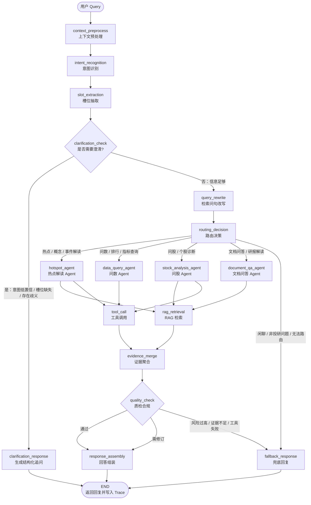

# LangGraph Agent 流转图

> **状态：已提供（去除测算版）**  
> 来源：`LangGraph_Agent_流转图_去除测算版.md`（用户交付）  
> 适用范围：T-012 LangGraph 真实编排、Trace 回放、Tester 验收。`steps[].node` 必须与下表节点 ID 一致。

**版本说明**：本流转图不含独立测算 Agent。涉及收益预测、目标价、未来涨跌等问题时，不得由模型自由测算；若需计算，仅允许通过 `tool_call` 执行公式固定、参数来自可信数据源的工具化计算，并记录输入、公式、输出与风险提示。

---

## 1. 节点清单

| 节点 ID | 说明 | 输入 | 输出 |
|---------|------|------|------|
| `context_preprocess` | 上下文预处理。接收 Query、会话历史、用户画像、业务上下文；完成清洗、裁剪、Query 标准化。 | `user_query`、`session_id`、`chat_history`、`user_profile`、`request_meta` | `normalized_query`、`context_pack`、`history_summary`、`risk_hint` |
| `intent_recognition` | 意图识别。识别热点、问数、问股、文档问答、闲聊、无法识别等，并输出置信度。 | `normalized_query`、`context_pack`、`history_summary` | `intent_id`、`intent_name`、`intent_confidence`、`candidate_intents`、`missing_slots` |
| `slot_extraction` | 槽位抽取。抽取标的、行业、时间范围、指标、市场、文档 ID 等。 | `normalized_query`、`intent_id`、`context_pack` | `slots`、`slot_confidence`、`missing_slots`、`ambiguous_slots` |
| `clarification_check` | 澄清判断。意图低置信、槽位缺失或歧义时进入澄清链路。 | `intent_id`、`intent_confidence`、`slots`、`missing_slots`、`ambiguous_slots` | `need_clarification`、`clarification_reason`、`clarification_questions` |
| `clarification_response` | 澄清回复。生成结构化追问，一次性补齐关键槽位。 | `clarification_reason`、`clarification_questions`、`normalized_query` | `final_response`、`next_expected_slots` |
| `query_rewrite` | Query 改写（Phase ① 规则+槽位拼接，无 LLM）。将口语化/多轮指代 Query 转为检索友好语句。 | `normalized_query`、`intent_id`、`slots`、`active_slots` | `retrieval_query`、`rewrite_method`、`retrieval_query_changed` |
| `routing_decision` | 路由决策。根据意图、槽位和上下文选择子 Agent 或工具链路。 | `intent_id`、`slots`、`context_pack`、`risk_hint` | `route_target`、`route_reason`、`execution_plan` |
| `hotspot_agent` | 热点解读 Agent。市场热点、概念异动、政策事件、产业趋势。 | `normalized_query`、`slots`、`execution_plan` | `agent_result`、`evidence_list`、`followup_need` |
| `data_query_agent` | 问数 Agent。排行、涨跌幅、估值、财务指标、成交额、资金流等。 | `normalized_query`、`slots`、`execution_plan` | `agent_result`、`data_table`、`data_source` |
| `stock_analysis_agent` | 问股 Agent。个股诊断、基本面、技术面、资金面、事件影响、风险提示。 | `normalized_query`、`slots`、`execution_plan` | `agent_result`、`analysis_dimensions`、`evidence_list` |
| `document_qa_agent` | 文档问答 Agent。研报、年报、公告、会议纪要等文档内问答。 | `normalized_query`、`slots`、`document_id`、`execution_plan` | `agent_result`、`quoted_chunks`、`doc_citations` |
| `tool_call` | 工具调用。封装行情、财务、新闻、研报、公告、搜索等工具。 | `route_target`、`execution_plan`、`slots`、`tool_params` | `tool_result`、`tool_status`、`tool_latency`、`tool_error` |
| `rag_retrieval` | RAG 检索。召回知识库、文档片段、研报段落、公告等。**当前实现**：主路径优先使用 `retrieval_query`（由 `query_rewrite` 产出），缺省回退 `normalized_query`；走 BM25 + 向量混合召回（可选 Rerank）；`supplement_mode` 仍用 `supplement_rag_queries`。 | `normalized_query`、`retrieval_query`、`intent_id`、`slots`、`retrieval_config` | `retrieved_chunks`、`retrieval_score`、`citations`、`low_confidence_flag` |
| `evidence_merge` | 证据聚合。整理工具结果、RAG 结果、结构化数据、子 Agent 输出。 | `tool_result`、`retrieved_chunks`、`agent_result` | `evidence_pack`、`citation_map`、`conflict_points` |
| `quality_check` | 质检合规。事实一致性、引用完整性、合规风险、投资建议越界检查。 | `agent_result`、`evidence_pack`、`citation_map`、`risk_hint` | `quality_status`、`quality_score`、`risk_level`、`revision_suggestions` |
| `response_assembly` | 回答组装。统一结构、引用、风险提示和追问建议。 | `agent_result`、`evidence_pack`、`quality_status`、`revision_suggestions` | `final_response`、`response_meta` |
| `fallback_response` | 兜底回复。意图无法识别、工具失败、检索低置信或合规风险过高时。 | `normalized_query`、`intent_id`、`tool_error`、`low_confidence_flag`、`risk_level` | `final_response`、`fallback_reason` |
| `END` | 流程结束。返回最终回答并写入 Trace。 | `final_response`、`response_meta` | `response`、`trace_id` |

---

## 2. 流转图



---

## 3. 分支条件

### 3.1 澄清分支

| 分支 | 触发条件 | 处理方式 |
|------|----------|----------|
| → `clarification_response` | `intent_confidence < 0.70` | 先追问真实意图，不直接执行任务 |
| → `clarification_response` | 核心槽位缺失（如问股缺股票名、问数缺指标或时间范围） | 结构化追问，一次性补齐关键槽位 |
| → `clarification_response` | 槽位歧义（如「茅台」多义） | 让用户选择或给出可选项 |
| → `query_rewrite` | `intent_confidence >= 0.70` 且核心槽位完整 | 规则+槽位拼接生成 `retrieval_query` |
| → `routing_decision` | `query_rewrite` 完成后 | 进入任务执行链路 |

### 3.2 路由分支

| 路由目标 | 典型意图 | 典型问题 | 关键槽位 |
|----------|----------|----------|----------|
| `hotspot_agent` | 热点解读、概念分析、事件归因 | 「商业航天为什么最近这么火？」 | `topic`、`industry`、`event`、`time_range` |
| `data_query_agent` | 问数、排行、指标查询 | 「近一周涨幅前五的机器人概念股有哪些？」 | `metric`、`rank_type`、`time_range`、`market`、`industry` |
| `stock_analysis_agent` | 问股、个股诊断、基本面 | 「帮我看一下泸州老窖基本面怎么样？」 | `stock_name`、`stock_code`、`analysis_dimension`、`time_range` |
| `document_qa_agent` | 文档问答、研报/年报解读 | 「这份研报的核心观点是什么？」 | `document_id`、`question`、`section`、`time_range` |
| `fallback_response` | 闲聊、无关、无法识别、要求预测/测算 | 「帮我预测明天一定涨的股票」 | `fallback_reason`、`risk_level` |

> **测算边界**：不设置独立测算 Agent。收益、估值、目标价、未来涨跌等问题不得模型自由生成；仅允许 `tool_call` 中公式固定、参数可信的工具化计算。

### 3.3 工具与 RAG 分支

| 分支 | 触发条件 | 处理方式 |
|------|----------|----------|
| → `tool_call` | 需实时行情、财务指标、排行等结构化数据 | 调用结构化数据工具 |
| → `rag_retrieval` | 需研报、公告、新闻、知识库等非结构化证据 | **混合检索**：BM25 关键词 + Embedding 向量加权融合（默认 35% / 65%），候选池 Top 30；配置 Rerank 时对 Top 8 精排；Embedding 不可用时降级 BM25-only |
| 并行 `tool_call` + `rag_retrieval` | 既需数据又需文本解释 | 并行获取，由 `evidence_merge` 聚合 |
| → `fallback_response` | 工具失败、RAG 低置信、证据不足 | 说明无法可靠回答，给出可查方向 |

### 3.4 质检合规分支

| 分支 | 触发条件 | 处理方式 |
|------|----------|----------|
| → `response_assembly`（通过） | 事实一致、引用完整、无明显合规风险 | 直接组装最终回答 |
| → `response_assembly`（需修订） | 引用不足、结构不清、风险提示缺失 | 带 `revision_suggestions` 修订后组装 |
| → `fallback_response` | 合规风险过高、证据不足、工具冲突、可能构成明确投资建议 | 安全兜底，避免确定性买卖建议 |

---

## 4. 与 Trace 字段映射

> `GET /api/traces/{trace_id}` 的 `steps[].node` 必须与 LangGraph 节点 ID 一致（英文 ID，不用中文展示名）。

| LangGraph 节点 | Trace `steps[].node` | Trace 重点字段 |
|----------------|----------------------|----------------|
| `context_preprocess` | `context_preprocess` | `input.user_query`、`output.normalized_query`、`output.context_pack` |
| `intent_recognition` | `intent_recognition` | `output.intent_id`、`output.intent_confidence`、`output.candidate_intents` |
| `slot_extraction` | `slot_extraction` | `output.slots`、`output.missing_slots`、`output.ambiguous_slots` |
| `clarification_check` | `clarification_check` | `output.need_clarification`、`output.clarification_reason` |
| `clarification_response` | `clarification_response` | `output.final_response`、`output.next_expected_slots` |
| `query_rewrite` | `query_rewrite` | `input.normalized_query`、`output.retrieval_query`、`output.rewrite_method`、`output.retrieval_query_changed` |
| `routing_decision` | `routing_decision` | `output.route_target`、`output.route_reason`、`output.execution_plan` |
| `hotspot_agent` | `hotspot_agent` | `input.slots`、`output.agent_result`、`output.evidence_list` |
| `data_query_agent` | `data_query_agent` | `input.slots`、`output.data_table`、`output.data_source` |
| `stock_analysis_agent` | `stock_analysis_agent` | `input.slots`、`output.analysis_dimensions`、`output.agent_result` |
| `document_qa_agent` | `document_qa_agent` | `input.document_id`、`output.quoted_chunks`、`output.doc_citations` |
| `tool_call` | `tool_call` | `input.tool_name`、`input.tool_params`、`output.tool_result`、`output.tool_status`、`output.tool_latency` |
| `rag_retrieval` | `rag_retrieval` | `input.normalized_query`、`input.retrieval_query`、`input.query`（实际检索句）、`input.rewrite_method`、`output.retrieved_chunks`、`output.retrieval_score`、`output.citations`、`output.mode`（`hybrid` / `bm25` / `mock`） |
| `evidence_merge` | `evidence_merge` | `output.evidence_pack`、`output.citation_map`、`output.conflict_points` |
| `quality_check` | `quality_check` | `output.quality_status`、`output.quality_score`、`output.risk_level`、`output.revision_suggestions` |
| `response_assembly` | `response_assembly` | `output.final_response`、`output.response_meta` |
| `fallback_response` | `fallback_response` | `output.final_response`、`output.fallback_reason` |
| `END` | `END` | `response`、`trace_id` |

### 与现有 fallback Trace 的差异（T-012 迁移注意）

当前 MVP fallback 使用较少节点（如 `master_bot_*` 命名）。V1.1 实现应逐步对齐上表节点 ID；前端 Trace 面板按 `node` 通用渲染，不依赖中文节点名。

---

## 5. Trace 示例结构（问数链路）

```json
{
  "trace_id": "trace_20260611_000001",
  "session_id": "session_xxx",
  "query": "白酒龙头热度排第几？主要带动哪些票？",
  "steps": [
    {
      "node": "context_preprocess",
      "status": "success",
      "input": {"user_query": "白酒龙头热度排第几？主要带动哪些票？"},
      "output": {"normalized_query": "查询白酒板块龙头标的热度排名，并分析其带动的相关股票"}
    },
    {
      "node": "intent_recognition",
      "status": "success",
      "output": {
        "intent_id": "data_query",
        "intent_confidence": 0.86,
        "candidate_intents": [
          {"intent_id": "data_query", "confidence": 0.86},
          {"intent_id": "hotspot_analysis", "confidence": 0.71}
        ]
      }
    },
    {
      "node": "slot_extraction",
      "status": "success",
      "output": {
        "slots": {"industry": "白酒", "metric": "热度排名", "relation": "带动个股"},
        "missing_slots": ["time_range"]
      }
    },
    {
      "node": "clarification_check",
      "status": "success",
      "output": {
        "need_clarification": false,
        "clarification_reason": "时间范围缺失但可使用默认近一交易日"
      }
    },
    {
      "node": "routing_decision",
      "status": "success",
      "output": {
        "route_target": "data_query_agent",
        "route_reason": "用户主要询问热度排名和关联个股，优先进入问数链路"
      }
    },
    {
      "node": "data_query_agent",
      "status": "success",
      "output": {"agent_result": "已查询白酒板块热度排名及关联个股"}
    },
    {
      "node": "tool_call",
      "status": "success",
      "output": {"tool_status": "success", "tool_latency": 820}
    },
    {
      "node": "evidence_merge",
      "status": "success",
      "output": {"conflict_points": []}
    },
    {
      "node": "quality_check",
      "status": "success",
      "output": {
        "quality_status": "pass",
        "risk_level": "medium",
        "revision_suggestions": ["补充风险提示，避免形成确定性投资建议"]
      }
    },
    {
      "node": "response_assembly",
      "status": "success",
      "output": {"final_response": "..."}
    }
  ]
}
```

---

## 6. 实现约束（T-012 必守）

1. **节点 ID 稳定**：`steps[].node` 使用上表英文 ID，不随前端文案变化。
2. **`routing_decision` 只决策**：选择 `route_target` 和 `execution_plan`，不直接生成最终答案。
3. **最终回答统一经 `response_assembly`**：保证引用格式、风险提示、合规口径一致。
4. **`tool_call` / `rag_retrieval` 可追踪**：记录输入、输出、耗时、失败原因、置信度。
5. **`quality_check` 在最终回答前执行**：检查引用、风险提示、确定性买卖建议、来源冲突。
6. **`fallback_response` 是安全策略**：证据不足或风险过高时兜底，不强行编造完整答案。

---

## 7. 路线图：待实现节点（V1.1 之后）

以下能力**已纳入产品规划**，但**不阻塞** T-012～T-013（V1.1 收尾）；优先级排在 V1.1 全链路验收与槽位体系完善之后。

### 7.1 `query_rewrite`（Query 改写）

| 项 | 说明 |
|----|------|
| **状态** | **已实现 Phase ①**（T-014）：规则+槽位拼接，无 LLM 改写 |
| **动机** | 多轮指代（「它一季报怎么样」）、口语化问法、槽位已齐但检索 Query 未结构化时，提升 RAG 召回率 |
| **落点** | `clarification_check` 通过 → **`query_rewrite`** → `routing_decision` → … → `rag_retrieval`（澄清链路不经过改写） |
| **输出** | `retrieval_query`（主检索句，写入 `rag_retrieval` input 与 Trace）；`rewrite_method`（`passthrough` / `rule_slots` / `rule_multiturn`）；`retrieval_query_changed` |
| **分阶段实现** | ① 规则/槽位拼接（**已完成**）→ ② 独立 LLM 改写节点 → ③ 多 Query 扩展 / HyDE（可选） |
| **当前行为** | `build_retrieval_query()` 纯规则拼接；Embedding 不可用时不阻断，RAG 仍走既有 BM25-only 降级；`supplement_mode` 不改写 |

### 7.2 槽位体系增强（与 Query 改写配套，优先于 LLM 改写）

| 项 | 说明 |
|----|------|
| **状态** | 骨架已有（`slot_extraction`、`clarification_check`、`clarification_response`） |
| **待补** | 按意图的必填槽位表（单一配置源）、`slot_confidence` 参与澄清阈值、会话级 `pending_slots` 多轮闭环 |
| **与改写关系** | 槽位 schema 稳定后，`query_rewrite` 才可可靠地把 `stock_name` / `time_period` 等拼进 `retrieval_query` |

### 7.3 短期对话记忆（5 轮 QA，F20）

| 项 | 说明 |
|----|------|
| **状态** | 骨架已有（`chat_history`、`history_summary`）；产品化与下游注入未实现；任务 **T-015**、**T-017** |
| **产品规则** | 同一会话内 Agent 仅消费最近 **5 轮 QA**（10 条消息）；更早消息仅 UI 可见 |
| **当前实现** | `LangGraphRunner._build_chat_history(limit=10)`；`context_preprocess._summarize_history`；`history_summary` 主要传入 `intent_recognition` |
| **待补（T-015）** | 窗口常量单一配置源；意图 Prompt 显式结合 `history_summary` 解析续问 |
| **待补（T-017）** | `slot_extraction`、子 Agent、`response_assembly` 注入 `history_summary` + `active_slots`；`evidence_pack.conversation_context` |
| **长期记忆** | 跨会话画像与偏好 **V2+ 延后**，不在本节点范围 |

### 7.4 推荐实施顺序（V1.2+）

1. **T-015** 五轮窗口产品化  
2. **T-016** 会话 `pending_slots` 跨轮闭环（§7.2 / F19）  
3. **T-017** 下游节点注入短期上下文  
4. **T-014** Query 改写（§7.1 / F18），依赖 2～3  

> **优先级结论（2026-06-12）**：先完成 V1.1（T-012～T-013）；多轮能力按 **T-015 → T-016 → T-017 → T-014** 排期。任务见 `.sdd/tasks.json`。
